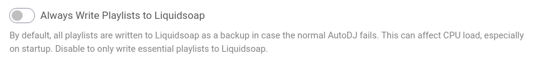
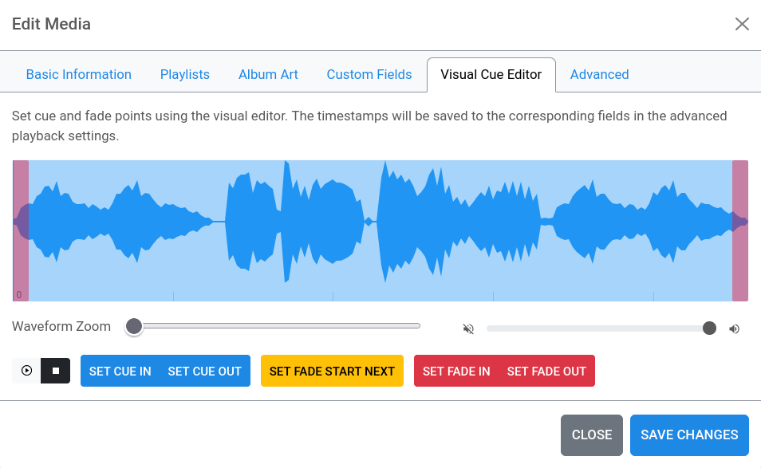
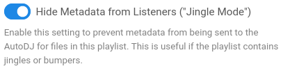
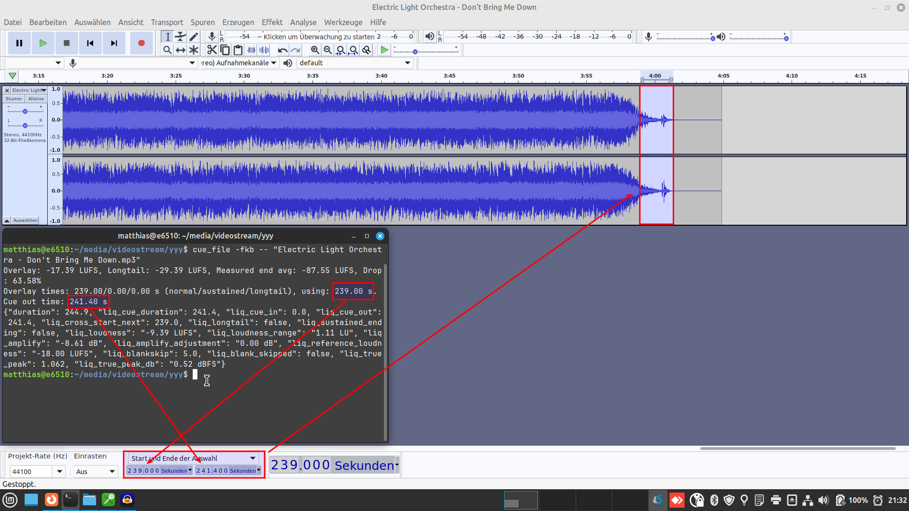

# FAQ – Frequently Asked Questions

## <a name="table-of-contents"></a>Table of Contents <a href="#toc" class="goToc">⇧</a>

<!-- ToC begin -->
<a name="toc"></a>

- [Table of Contents](#table-of-contents)
- [How to avoid long station startup time?](#how-to-avoid-long-station-startup-time)
- [How to assure jingles are not cut off?](#how-to-assure-jingles-are-not-cut-off)
- [How to ensure pre-recorded shows or podcasts aren’t cut off early?](#how-to-ensure-pre-recorded-shows-or-podcasts-arent-cut-off-early)
- [How to pre-process more than one file at a time ("mass tagging")?](#how-to-pre-process-more-than-one-file-at-a-time-mass-tagging)
- [What tagging software to use?](#what-tagging-software-to-use)
- [Can I use `cue_file` to replaygain my files?](#can-i-use-cue_file-to-replaygain-my-files)
- [Can I use `cue_file` to _manually_ add/overwrite tags when pre-processing?](#can-i-use-cue_file-to-manually-addoverwrite-tags-when-pre-processing)
- [How to make transitions _tighter_, i.e. overlay earlier?](#how-to-make-transitions-tighter-ie-overlay-earlier)
- [How to make transitions _longer_, i.e. overlay later and keep every bit of a song ending?](#how-to-make-transitions-longer-ie-overlay-later-and-keep-every-bit-of-a-song-ending)
- [Can I completely _disable_ the "sustained endings" feature?](#can-i-completely-disable-the-sustained-endings-feature)
- [Can I completely _disable_ the "longtail" feature?](#can-i-completely-disable-the-longtail-feature)
- [How to ensure Autocue doesn’t mess with Ad Insertion files?](#how-to-ensure-autocue-doesnt-mess-with-ad-insertion-files)
- [How to ensure Autocue doesn’t try to process video files?](#how-to-ensure-autocue-doesnt-try-to-process-video-files)
- [Why should I use `check_autocue_setup`, and what does it do?](#why-should-i-use-check_autocue_setup-and-what-does-it-do)
- [What are good first steps to use Autocue in my own Liquidsoap script?](#what-are-good-first-steps-to-use-autocue-in-my-own-liquidsoap-script)
- [What will happen when I switch to the upcoming Liquidsoap 2.3.0?](#what-will-happen-when-i-switch-to-the-upcoming-liquidsoap-230)
- [What can I do if some files or a remote playlist simply _don’t play?_](#what-can-i-do-if-some-files-or-a-remote-playlist-simply-dont-play)
- [What exactly is `liq_cue_file` for, and should I use it?](#what-exactly-is-liq_cue_file-for-and-should-i-use-it)
<!-- Generated by gh-toc, https://moonbase59.github.io/gh-toc/ -->
<!-- ToC end -->

## <a name="how-to-avoid-long-station-startup-time"></a>How to avoid long station startup time? <a href="#toc" class="goToc">⇧</a>

To ensure continuous playout without interruptions, Liquidsoap tries to prepare _at least one track from each playlist_ to be ready for switching and fallbacks. This can strain your system a bit on startup, especially if you have long files like _recordings_, _prerecorded shows_, _DJ sets_, _podcasts_ and the like. The number of existing playlists also affects startup time.

There are two basic strategies to avoid this, which can also be used in combination:

- _Pre-process_ your files (at least the long ones!) using the commandline tool `cue_file`, using the same settings your station uses. The docs have a [reference table](README.md#reference-to-parameters-and-settings) for easy lookup.
- Disable processing _all_ files at startup.

### AzuraCast

- In _Profile → Edit Profile → AutoDJ → Advanced Configuration_, _disable_ the setting _Always Write Playlists to Liquidsoap_.
  

### Liquidsoap

- Do _not_ use `enable_autocue_metadata()`, but the `autocue:` protocol instead.
- This needs to be done for _requests_, _single_, and _playlists_, usually _before_ any annotations. Example:
  ```
  shows = playlist(prefix='autocue:annotate:liq_blankskip=0.0:', 'show-playlist.m3u')
  ```
- _Never_ use _both_ `enable_autocue_metadata` and the `autocue:` protocol together! This would lead to unneccessary processing of each file _twice!_

## <a name="how-to-assure-jingles-are-not-cut-off"></a>How to assure jingles are not cut off? <a href="#toc" class="goToc">⇧</a>

Set the jingle’s _fade-in_ and _fade-out_ times to a short value, like `0.1` seconds. This will override the default settings and ensure the jingle is not faded out early. It is advisable to also set the _blank skipping_ feature _off_ by using a value of `0.0` seconds.

### AzuraCast

- Use the _Visual Cue Editor_ or the _Advanced_ tab next to it to set both _fade-in_ and _fade-out_ to `0.1` seconds.
  
  
- Play jingles from a playlist that has _Hide Metadata from Listeners ("Jingle Mode")_ switched _on_.
  

### Liquidsoap

- Use an `annotate:` prefix on a jingles playlist to set `liq_fade_in`, `liq_fade_out`, and `liq_blankskip`:
  ```
  jingles = playlist(prefix='annotate:liq_fade_in=0.1,liq_fade_out=0.1,liq_blankskip=0.0:', 'playlist.m3u')
  ```

### Tagging

- Set the appropriate tags:
  |Tag|Value|
  |---|-----|
  |liq_blankskip|0.00|
  |liq_fade_in|0.10|
  |liq_fade_out|0.10|


## <a name="how-to-ensure-pre-recorded-shows-or-podcasts-arent-cut-off-early"></a>How to ensure pre-recorded shows or podcasts aren’t cut off early? <a href="#toc" class="goToc">⇧</a>

Pre-recorded shows and podcasts often have _pauses_, which could trigger the `blankskip` logic and thus end playout at such a pause. If you have global blank skipping _on_ (`settings.autocue.cue_file.blankskip` > `0.00`), this could hit you.

- The solution here is to _switch off_ blank skipping for such a track or playlist, usually done in pre-processing.

### Pre-processing

- Simply _do not use_ the `-b`/`--blankskip` parameter with `cue_file`. This will set `liq_blankskip=0.00`.

### Liquidsoap

- Use an `annotate:` prefix on a show or podcast playlist to set `liq_blankskip` to zero (=disabled):
  ```
  shows = playlist(prefix='annotate:liq_blankskip=0.0:', 'show-playlist.m3u')
  ```

### Tagging

- Set the appropriate tags:
  |Tag|Value|
  |---|-----|
  |liq_blankskip|0.00|


## <a name="how-to-pre-process-more-than-one-file-at-a-time-mass-tagging"></a>How to pre-process more than one file at a time ("mass tagging")? <a href="#toc" class="goToc">⇧</a>

`cue_file` is a tool that processes only _one_ track at a time.

- You can write your own "wrapper" around it.
- You can use/modify the _shell script_ @LordHelmchen666 [kindly provided](https://github.com/AzuraCast/AzuraCast/discussions/6252#discussioncomment-9782783). Note this is for running on the station, and handles MP3 and WMA files only. It’s very easy to adapt, though.
- Bear in mind you _should_ have separate sub-folders for tracks that require different pre-processing parameters! Example:
  - Songs (normal handling, incl. `blankskip` if you like)
  - Jingles, Ads (switch blankskip off, set fades)
  - Pre-recorded shows, DJ sets (switch blankskip off)
  - Podcasts (switch blankskip off)
  - Recordings (switch blankskip off)


## <a name="what-tagging-software-to-use"></a>What tagging software to use? <a href="#toc" class="goToc">⇧</a>

That very much depends, but most of them have some drawbacks, can’t handle all file types, or simply corrupt files because they do something wrong. Sad experience from 25+ years of tagging music files.

### Tagging software I trust and use

Most of these are available for Linux, MacOS and Windows.

- [_MusicBrainz Picard_](https://picard.musicbrainz.org/) — Ideal for initial tagging of files, and you help the community when getting a free MusicBrainz account and help adding new albums. Uses _Mutagen_.
- [_Kid3_](https://kid3.kde.org/) — Originally part of the KDE desktop, but can be installed on others. Very good for "the quick fix", like changing `liq_blankskip`.
- _cue_file_. For pre-processing and adding Autocue/ReplayGain (track) data. Uses _Mutagen_.
- [_mid3v2_](https://mutagen.readthedocs.io/en/latest/man/mid3v2.html) — Part of _Mutagen_, nice to quickly change a tag or two in a shell script. Only for MP3, though.
- [MP3 Diags](https://mp3diags.sourceforge.net/) — To repair some hard-to-catch problems with MP3 files. Not for general tagging.
- Honorable mention: [foobar2000](https://www.foobar2000.org/) — Windows only. Versatile player/tag editor that also does things right.

As always, you should _know what you’re doing_, and set up these tools appropriately.

### Recommendation

- **Get rid of ID3v1 tags.** They are obsolete nowadays and only good for real vintage MP3 players. Saving _both_ ID3v1 and ID3v2 tags can lead to all kinds of obscure and unwanted problems.
- With MP3 files (and very few others), use **ID3v2.4** type tags. They are modern and handle UTF-8 encoding well.
- If you _cannot_ use ID3v2.4 (because you have some old players that can’t handle that tag format), use **ID3v2.3.0** and **UTF-16** encoding (this tag format doesn’t yet know about UTF-8).


## <a name="can-i-use-cue_file-to-replaygain-my-files"></a>Can I use `cue_file` to replaygain my files? <a href="#toc" class="goToc">⇧</a>

- _Yes_, you absolutely can, if you can live without the ReplayGain album data (`cue_file` has no concept of an album). `cue_file` basically follows the same logic [`loudgain`](https://github.com/Moonbase59/loudgain) uses, but doesn’t have all its features.
- Just add the `-r`/`--replaygain` parameter _in addition to_ `-w`/`--write` when using `cue_file` for pre-processing and it will write these ReplayGain2 tags:
  |Tag|Unit|
  |---|----|
  |replaygain_reference_loudness|LUFS|
  |replaygain_track_gain|dB|
  |replaygain_track_peak|true peak, linear|
  |replaygain_track_range|dB|


## <a name="can-i-use-cue_file-to-manually-addoverwrite-tags-when-pre-processing"></a>Can I use `cue_file` to _manually_ add/overwrite tags when pre-processing? <a href="#toc" class="goToc">⇧</a>

- _Yes_, you can, even _after_ forcing a re-analysis (v4.0.4+).
- _Only_ tags from `cue_file`’s list of _known_ tags (see `cue_file --help`) will ever been written by `cue_file`. So no overriding artist or title here—that’s what should have been done in an earlier step, using a good tagging software.
- **Use with care!** Some values are dependent on others, you could easily mess up something.
- You **must** create _well-formed JSON_ and can then use `cue_file` with the `-j`/`--json` switch to let your tags override or add to what’s already there.

#### Example: Adding fade-in and fade-out, using `echo` and `stdin`

```bash
echo '{"liq_fade_in": 0.1, "liq_fade_out": 0.1}' | cue_file -j - -fwr "filename.ext"
```
- `-j -` — sets JSON input to `stdin`
- `-fwr` — _force_ re-analysis, _write_ tags, write _replaygain_

#### Example: using a JSON file `fades.json`

```json
{
  "liq_fade_in": 0.10,
  "liq_fade_out": 0.10
}
```
```bash
cue_file -j fades.json -fwr "filename.ext"
```
- `-j fades.json` — read JSON data from file `fades.json`
- `-fwr` — _force_ re-analysis, _write_ tags, write _replaygain_


## <a name="how-to-make-transitions-tighter-ie-overlay-earlier"></a>How to make transitions _tighter_, i.e. overlay earlier? <a href="#toc" class="goToc">⇧</a>

- First, try to _decrease_ `-d`/`--drop`/`settings.autocue.cue_file.sustained_loudness_drop` _gradually_. The default is `40.0`%, so maybe go down in 10% increments and see how you like it.
- Second, if the above isn’t sufficient, try _decreasing_ `-x`/`--extra`/`settings.autocue.cue_file.overlay_longtail` _gradually_. The (new) default is `-12.0` LU, you could try decreasing in 2 LU increments. **Note:** This affects _both_ "sustaned endings" and "longtail" handling.
- Don’t forget the `-f`/`--force` switch in `cue_file`, so you get real, freshly analyzed results!

I recommend _testing_ this on a few selected test songs, _before_ you modify your station settings or re-tag all your files! A good tool is for instance [_Audacity_](https://www.audacityteam.org/), you can switch the selection input to seconds start & end, and just enter the values cue_file got you on the test file.




## <a name="how-to-make-transitions-longer-ie-overlay-later-and-keep-every-bit-of-a-song-ending"></a>How to make transitions _longer_, i.e. overlay later and keep every bit of a song ending? <a href="#toc" class="goToc">⇧</a>

- First, try to _increase_ `-d`/`--drop`/`settings.autocue.cue_file.sustained_loudness_drop` _gradually_. The default is `40.0`%, so maybe go up in 10% increments and see how you like it. A good value is `60.0`%.
- Second, if the above isn’t sufficient, try _increasing_ `-x`/`--extra`/`settings.autocue.cue_file.overlay_longtail` _gradually_. The (new) default is `-12.0` LU, you could try increasing in 2 LU increments. A good value is `-15.0` LU. **Note:** This affects _both_ "sustaned endings" and "longtail" handling.
- Don’t forget the `-f`/`--force` switch in `cue_file`, so you get real, freshly analyzed results!

I recommend _testing_ this on a few selected test songs, _before_ you modify your station settings or re-tag all your files! A good tool is for instance [_Audacity_](https://www.audacityteam.org/), you can switch the selection input to seconds start & end, and just enter the values cue_file got you on the test file.


## <a name="can-i-completely-disable-the-sustained-endings-feature"></a>Can I completely _disable_ the "sustained endings" feature? <a href="#toc" class="goToc">⇧</a>

I can’t see a reason for it, but _yes_, you can.

- Just set `-d`/`--drop`/`settings.autocue.cue_file.sustained_loudness_drop` to _zero_ (`0.0`%), which will disable this feature.

## <a name="can-i-completely-disable-the-longtail-feature"></a>Can I completely _disable_ the "longtail" feature? <a href="#toc" class="goToc">⇧</a>

Again, I don’t see a reason for it, but you can.

- Just set `-x`/`--extra`/`settings.autocue.cue_file.overlay_longtail` to _zero_ (`0.0` LU), which will disable this feature. **Note:** This affects _both_ "sustaned endings" and "longtail" handling.


## <a name="how-to-ensure-autocue-doesnt-mess-with-ad-insertion-files"></a>How to ensure Autocue doesn’t mess with Ad Insertion files? <a href="#toc" class="goToc">⇧</a>

Ad insertion files are special files that usually shouldn’t be tampered with. You can set or annotate the special tag `liq_cue_file` and set it to `false`, which will keep Autocue from doing _anything_ with this track.

Should an ad insertion file need replaygaining, remember to _also_ set `liq_amplify` to the same value your `replaygain_track_gain` shows.

### Liquidsoap

- Use an `annotate:` prefix on a playlist to set `liq_cue_file` to `false` (=disable Autocue):
  ```
  ad_inserts = playlist(prefix='annotate:liq_cue_file=false:', 'ad-inserts.m3u')
  ```

### Tagging

- Set the appropriate tags:
  |Tag|Value|
  |---|-----|
  |liq_cue_file|false|


## <a name="how-to-ensure-autocue-doesnt-try-to-process-video-files"></a>How to ensure Autocue doesn’t try to process video files? <a href="#toc" class="goToc">⇧</a>

Some stations have _video streams_. Now `cue_file` _can_ process even multi-GB video files, but it’ll use CPU and take long. Resources wasted if you overlay the video’s audio with your radio stream anyway!

You can set or annotate the special tag `liq_cue_file` and set it to `false`, which will keep Autocue from doing _anything_ with video files.

### Liquidsoap

- Use an `annotate:` prefix on a playlist to set `liq_cue_file` to `false` (=disable Autocue):
  ```
  videos = playlist(prefix='annotate:liq_cue_file=false:', 'videos.m3u')
  ```

### Tagging

- Set the appropriate tags:
  |Tag|Value|
  |---|-----|
  |liq_cue_file|false|

- This will probably only work for `.mp4` type videos right now. Mutagen doesn’t yet support the Matroska (`.mkv`) and WebM (`.webm`) EBML data structure.


## <a name="why-should-i-use-check_autocue_setup-and-what-does-it-do"></a>Why should I use `check_autocue_setup`, and what does it do? <a href="#toc" class="goToc">⇧</a>

It’s a little check to ensure things for `autocue.cue_file` have been set up correctly, and a good diagnostic, since it logs the versions of your `autocue.cue_file.liq` and external `cue_file` to the log (and console if you set `print=true`). It is important that the Liquidsoap script and the external `cue_file` are the same version, and `autocue.cue_file` integrated properly, otherwise odd things could happen, or Liquidsoap could fall back to its _internal autocue_, and you wouldn’t get the results you expect.

So _always_ use it, _after_ your settings and _before_ a possible `enable_autocue_metadata()`. (AzuraCast does this automatically for you, so nothing to add in any input box.)

`check_autocue_setup` will…

- check if your `autocue.cue_file.liq` and external `cue_file` versions match and log the result for easier debugging:
  ```
  2024/06/21 06:46:51 [autocue.cue_file:2] You are using autocue.cue_file version 4.0.3.
  2024/06/21 06:46:51 [autocue.cue_file:2] The external "cue_file" is version 4.0.3
  ```
- set its metadata priority: `settings.autocue.metadata.priority := 10`
- set the preferred autocue implementation: `settings.autocue.preferred := "cue_file"`
- set the correct "amplify behaviour": `settings.autocue.amplify_behavior := "keep"`
- set the default cross duration to your specified fade-out duration: `settings.autocue.target_cross_duration := settings.autocue.cue_file.fade_out()`. This is done to avoid problems when your default fade-out is different from Liquidsoap’s default cross duration of `3.0` seconds. The result is logged:
  ```
  2024/06/21 06:46:51 [autocue.cue_file:2] Setting `settings.autocue.target_cross_duration` to 2.5 s, from `settings.autocue.cue_file.fade_out`.
  ```
- If you set `print=true`, the results will also be shown on the console. This is practical when programming, so you don’t have to find the log and look it up.
- If you set `shutdown=true`, your Liquidsoap script will shut down if an error occurs. Most of the time, _you should set this_, because the results are unspecified or you can get a lot of errors if the versions of `autocue.cue_file.liq` and `cue_file` don’t match.
- The log/console output in case of an error looks like this:
  ```
  ERROR: autocue.cue_file v4.0.3 doesn’t match external "cue_file" v4.0.2!
  Autocue NOT ACTIVATED!
  Shutting down...
  ```

`check_autocue_setup` can be used in two ways:

- **Automatic:** Handles everything for you, including Liquidsoap shutdown:
  ```
  ignore(check_autocue_setup(shutdown=true, print=true))
  ```
- **Manual:** You want to do some special processing, depending on its result:
  ```
  if check_autocue_setup(shutdown=false, print=false) then
    # all okay, your code here
  else
    # error ocurred, your code here
  end
  ```

## <a name="what-are-good-first-steps-to-use-autocue-in-my-own-liquidsoap-script"></a>What are good first steps to use Autocue in my own Liquidsoap script? <a href="#toc" class="goToc">⇧</a>

- Install Liquidsoap and [Autocue](README.md#install), obviously.
- _Start simple, use the defaults._ It should _work_ first, _then_ you can fine-tune it.
- A good example is in [minimal_example_autocue.cue_file.liq](minimal_example_autocue.cue_file.liq). It shows the basic structure:
  - `%include "autocue.cue_file.liq"`
  - Do your settings. You can copy _all_ settings [from the README](README.md#settings), and only un-comment those you need. The advantage is: You have them all together and don’t have to look them up every time.
  - `ignore(check_autocue_setup(shutdown=true, print=true))`
  - `enable_autocue_metadata()` if you want to use it.
  - Rest of your script.

If you plan to use _custom crossfading_,

- remember that some functions, like `fade_in` and `fade_out` need _metadata passed to them_.
- instead of hard-coding values into the crossfading function, use the `autocue.cue_file` _settings_. Doing so will later allow easy changing _in just one place_ and avoid obscure side-effects if you forgot to change something.

Plan for _diagnostics logging_. The Liquidsoap integration layer might change things you can’t see in the `autocue.cue_file` log output. It can be useful to write a `show_meta` function that gets called `on_metadata`.

Good examples for all this are in [`test_autocue.cue_file.liq`](test_autocue.cue_file.liq). Study the `def live_aware_crossfade(old, new)` and `def show_meta(m)` function definitions and their usage.

Have fun!


## <a name="what-will-happen-when-i-switch-to-the-upcoming-liquidsoap-230"></a>What will happen when I switch to the upcoming Liquidsoap 2.3.0? <a href="#toc" class="goToc">⇧</a>

Nothing is definite yet, Liquidsoap 2.3.0 is still under heavy development.

Most certainly, as of 2024-06-23…

- you will need a _new version_ of both `autocue.cue_file` and `cue_file`, because Liquidsoap will change the tags and API.
- you’ll need to _pre-process your files again_, if you have used that feature.
- I will see that `cue_file` will be able to _remove obsolete tags_.
- if possible, I’ll do some _checking_ so that you don’t run `autocue.cue_file` (and thus `cue_file`) under an incompatible Liquidsoap version. The `check_autocue_setup()` function will take care of that.
- `liq_fade_in` might change to `liq_fade_in_duration`.
- `liq_fade_out` might change to `liq_fade_out_duration`.
- `liq_cross_duration` will be split into
  - `liq_cross_start_duration` and
  - `liq_cross_end_duration`,

  which makes some internal handling much more straightforward.

See also:

- https://github.com/savonet/liquidsoap/pull/3931#issuecomment-2184937173


## <a name="what-can-i-do-if-some-files-or-a-remote-playlist-simply-dont-play"></a>What can I do if some files or a remote playlist simply _don’t play?_ <a href="#toc" class="goToc">⇧</a>

This most often happens with _large files_, _large remote files_, and files that are _hard to analyse_ because they’re already clipping (too loud).

Check your Liquidsoap log for entries like

```
2024/06/26 10:01:43 [request:2] Time limit exceeded by 16.00 secs!
```

This can happen if the _downloading/preparing is slow_, or the _files are large_ (recordings, prerecorded shows, DJ sets, podcasts) or _hard to analyse_. These factors are out of our control. If a request timeout happens, the file will simply _not be played_, and the _next available used_.

Playing from a _remote playlist_ presents another hurdle: Liquidsoap will then _download_ a temporary copy of the file(s) in the playlist, autocue _that copy_, and when it has played, will _delete it again_. So next time round, the same file will have to be _analyzed again_.

In such cases, I suggest to _pre-tag_ files using the `cue_file` tool, but this might not always be possible.

In the above case, I’d suggest _increasing the Autocue timeout slightly_ from the default `60.0` seconds to `60` + timeout shown (`16.0`) + a small "safety margin", say another `10` seconds, making for `86` seconds. Let’s round that up to `90` seconds.

In AzuraCast’s _Edit Liquidsoap Configuration_, in the _second input box_, add this parameter:
```
settings.autocue.cue_file.timeout := 90.0
```

**Note:** Please do _not_ use arbitrary large values like `480.0` "just to prevent it happening"! Doing so could well have adverse side effects.

_Save Changes_ and _Restart Broadcasting_.

Keep watching your logs for timeouts, just in case even larger files arrive. You can search for `Time limit exceeded` to quickly find such entries in the log.

If the above should _not_ help, you should look for a _faster/higher bandwidth connection_ to the source you download the files from. To be able to _work_ with a file, Liquidsoap has to download a complete copy first, before autocueing and playout can begin.


## <a name="what-exactly-is-liq_cue_file-for-and-should-i-use-it"></a>What exactly is `liq_cue_file` for, and should I use it? <a href="#toc" class="goToc">⇧</a>

Starting with v4.1.0, we have a new `liq_cue_file` handling, which allows to ignore overrides for `cue_file` data if true. This is mainly for fast-changing files like news or time, for which LS/AzuraCast might not yet have updated the metadata.

- _not set_ — default behaviour (metadata can override `cue_file` results)
- `false` — don’t autocue (still use metadata if present)
- `true` — `cue_file` results override metadata (special use cases)

### What does that mean for me?

AzuraCast and other third-party apps can store (cache) `cue_file` metadata in order to speed up processing. They can also decide to _override_ certain `cue_file` results like _cue_, _fading_ and _ramp_ points, as is done in AzuraCast’s _Visucal Cue Editor_ (VCE) and Advanced track edit tab.

#### Normal operation

For normal operation, just make sure the _tag_ `liq_cue_file` is _not_ set, and you don’t _annotate_ it. Your radio automation will then be able to use whatever Autocue has calculated, and—if needed—be able to _override results_, for instance in AzuraCast’s VCE/Advanced tab.

#### Fast-changing news, time announcements, etc.

Now if you aggregate syndicated news, spoken time announcements or the like _outside_ the app, and use _the same filename_, the app might not immediately know about the change and update its stored metadata, resulting in _wrong_ metadata on playout, even when you carefully pre-tagged the file with `cue_file` in your external process. For instance, AzuraCast’s _media checker_ runs only about every five minutes or so. If you download a syndicated news file at 9:59 and prepare it at 9:59:45, to be played at 10:00 sharp, chances are good the media checker hasn’t yet hit in and updated the metadata. Result: Problems.

If you now _pre-tag_ such a file in your external process, using the `liq_cue_file` tag and set it to `true`, the Autocue in Liquidsoap will know you want to use the _tagged_ `cue_file` results and _ignore_ the values it might have gotten from elsewhere (stored, annotated, etc.).

A corresponding _log entry_ will be made by Autocue in this case:

```
[autocue.cue_file:3] cue_file results override existing metadata because liq_cue_file=true tells us to.
```

#### Large video files and others you don’t want to autocue

Autocue is a CPU-intensive process. So if your station plays large video files, for instance, you will want to _exclude_ these from being autocued. Do this by _tagging_ or _annotating_ the file or playlist using `liq_cue_file` and set it to `false`. Even if Autocue is enabled by default, it will then know to skip these files and write a log entry to that effect:

```
[autocue.cue_file:2] Skipping cue_file for "filename" because liq_cue_file=false forbids it.
```
