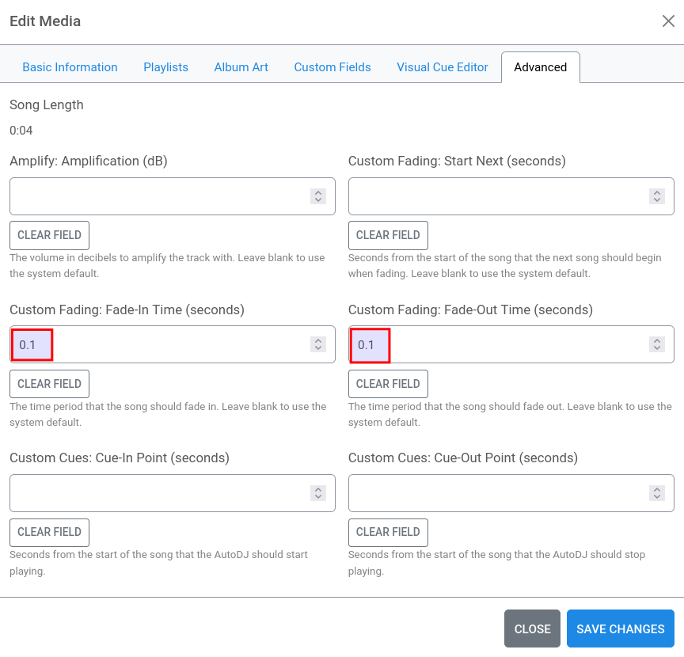

# FAQ – Frequently Asked Questions

## <a name="table-of-contents"></a>Table of Contents <a href="#toc" class="goToc">⇧</a>

<!-- ToC begin -->
<a name="toc"></a>

- [Table of Contents](#table-of-contents)
- [How to avoid long station startup time?](#how-to-avoid-long-station-startup-time)
- [How to assure jingles are not cut off?](#how-to-assure-jingles-are-not-cut-off)
- [How to ensure pre-recorded shows or podcasts aren’t cut off early?](#how-to-ensure-pre-recorded-shows-or-podcasts-arent-cut-off-early)
- [How to pre-process more than one file at a time ("mass tagging")?](#how-to-pre-process-more-than-one-file-at-a-time-mass-tagging)
- [What tagging software to use?](#what-tagging-software-to-use)
- [Can I use `cue_file` to replaygain my files?](#can-i-use-cue_file-to-replaygain-my-files)
<!-- Generated by gh-toc, https://moonbase59.github.io/gh-toc/ -->
<!-- ToC end -->

## <a name="how-to-avoid-long-station-startup-time"></a>How to avoid long station startup time? <a href="#toc" class="goToc">⇧</a>

To ensure continuous playout without interruptions, Liquidsoap tries to prepare _at least one track from each playlist_ to be ready for switching and fallbacks. This can strain your system a bit on startup, especially if you have long files like _recordings_, _prerecorded shows_, _DJ sets_, _podcasts_ and the like. The number of existing playlists also affects startup time.

There are two basic strategies to avoid this, which can also be used in combination:

- _Pre-process_ your files (at least the long ones!) using the commandline tool `cue_file`, using the same settings your station uses. The docs have a [reference table](README.md#reference-to-parameters-and-settings) for easy lookup.
- Disable processing _all_ files at startup.

### AzuraCast

- In _Profile → Edit Profile → AutoDJ → Advanced Configuration_, _disable_ the setting _Always Write Playlists to Liquidsoap_.
  

### Liquidsoap

- Do _not_ use `enable_autocue_metadata()`, but the `autocue:` protocol instead.
- This needs to be done for _requests_, _single_, and _playlists_, usually _before_ any annotations. Example:
  ```
  shows = playlist(prefix='autocue:annotate:liq_blankskip=0.0:', 'show-playlist.m3u')
  ```
- _Never_ use _both_ `enable_autocue_metadata` and the `autocue:` protocol together! This would lead to unneccessary processing of each file _twice!_

## <a name="how-to-assure-jingles-are-not-cut-off"></a>How to assure jingles are not cut off? <a href="#toc" class="goToc">⇧</a>

Set the jingle’s _fade-in_ and _fade-out_ times to a short value, like `0.1` seconds. This will override the default settings and ensure the jingle is not faded out early. It is advisable to also set the _blank skipping_ feature _off_ by using a value of `0.0` seconds.

### AzuraCast

- Use the _Visual Cue Editor_ or the _Advanced_ tab next to it to set both _fade-in_ and _fade-out_ to `0.1` seconds.
  
  
- Play jingles from a playlist that has _Hide Metadata from Listeners ("Jingle Mode")_ switched _on_.
  

### Liquidsoap

- Use an `annotate:` prefix on a jingles playlist to set `liq_fade_in`, `liq_fade_out`, and `liq_blankskip`:
  ```
  jingles = playlist(prefix='annotate:liq_fade_in=0.1,liq_fade_out=0.1,liq_blankskip=0.0:', 'playlist.m3u')
  ```

### Tagging

- Set the appropriate tags:
  |Tag|Value|
  |---|-----|
  |liq_blankskip|0.00|
  |liq_fade_in|0.10|
  |liq_fade_out|0.10|


## <a name="how-to-ensure-pre-recorded-shows-or-podcasts-arent-cut-off-early"></a>How to ensure pre-recorded shows or podcasts aren’t cut off early? <a href="#toc" class="goToc">⇧</a>

Pre-recorded shows and podcasts often have _pauses_, which could trigger the `blankskip` logic and thus end playout at such a pause. If you have global blank skipping _on_ (`settings.autocue.cue_file.blankskip` > `0.00`), this could hit you.

- The solution here is to _switch off_ blank skipping for such a track or playlist, usually done in pre-processing.

### Pre-processing

- Simply _do not use_ the `-b`/`--blankskip` parameter with `cue_file`. This will set `liq_blankskip=0.00`.

### Liquidsoap

- Use an `annotate:` prefix on a show or podcast playlist to set `liq_blankskip` to zero (=disabled):
  ```
  shows = playlist(prefix='annotate:liq_blankskip=0.0:', 'show-playlist.m3u')
  ```

### Tagging

- Set the appropriate tags:
  |Tag|Value|
  |---|-----|
  |liq_blankskip|0.00|


## <a name="how-to-pre-process-more-than-one-file-at-a-time-mass-tagging"></a>How to pre-process more than one file at a time ("mass tagging")? <a href="#toc" class="goToc">⇧</a>

`cue_file` is a tool that processes only _one_ track at a time.

- You can write your own "wrapper" around it.
- You can use/modify the _shell script_ @LordHelmchen666 [kindly provided](https://github.com/AzuraCast/AzuraCast/discussions/6252#discussioncomment-9782783). Note this is for running on the station, and handles MP3 and WMA files only. It’s very easy to adapt, though.
- Bear in mind you _should_ have separate sub-folders for tracks that require different pre-processing parameters! Example:
  - Songs (normal handling, incl. `blankskip` if you like)
  - Jingles, Ads (switch blankskip off, set fades)
  - Pre-recorded shows, DJ sets (switch blankskip off)
  - Podcasts (switch blankskip off)
  - Recordings (switch blankskip off)


## <a name="what-tagging-software-to-use"></a>What tagging software to use? <a href="#toc" class="goToc">⇧</a>

That very much depends, but most of them have some drawbacks, can’t handle all file types, or simply corrupt files because they do something wrong. Sad experience from 25+ years of tagging music files.

### Tagging software I trust and use

- [_MusicBrainz Picard_](https://picard.musicbrainz.org/) — Ideal for initial tagging of files, and you help the community when getting a free MusicBrainz account and help adding new albums. Uses _Mutagen_.
- [_Kid3_](https://kid3.kde.org/) — Originally part of the KDE desktop, but can be installed on others. Very good for "the quick fix", like changing `liq_blankskip`.
- _cue_file_. For pre-processing and adding Autocue/ReplayGain (track) data. Uses _Mutagen_.
- _mid3v2_ — Part of _Mutagen_, nice to quickly change a tag or two in a shell script. Only for MP3, though.
- [MP3 Diags](https://mp3diags.sourceforge.net/) — To repair some hard-to-catch problems with MP3 files. Not for general tagging.

As always, you should _know what you’re doing_, and set up these tools appropriately.

### Recommendation

- **Get rid of ID3v1 tags.** They are obsolete nowadays and only good for real vintage MP3 players. Saving _both_ ID3v1 and ID3v2 tags can lead to all kinds of obscure and unwanted problems.
- With MP3 files (and very few others), use **ID3v2.4** type tags. They are modern and handle UTF-8 encoding well.
- If you _cannot_ use ID3v2.4 (because you have some old players that can’t handle that tag format), use **ID3v2.3.0** and **UTF-16** encoding (this tag format doesn’t yet know about UTF-8).


## <a name="can-i-use-cue_file-to-replaygain-my-files"></a>Can I use `cue_file` to replaygain my files? <a href="#toc" class="goToc">⇧</a>

- Yes, you absolutely can, if you can live without the ReplayGain album data (`cue_file` has no concept of an album). `cue_file` basically follows the same logic [`loadgain`](https://github.com/Moonbase59/loudgain) uses, but doesn’t have all its features.
- Just add the `-r`/`--replaygain` parameter _in addition to_ `-w`/`--write` when using `cue_file` for pre-processing and it will write these ReplayGain2 tags:
  |Tag|Unit|
  |---|----|
  |replaygain_reference_loudness|LUFS|
  |replaygain_track_gain|dB|
  |replaygain_track_peak|true peak, linear|
  |replaygain_track_range|dB|
