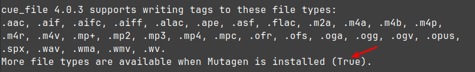

# <a name="autocue"></a>autocue <a href="#toc" class="goToc">⇧</a>

**If you like what you got, please consider to [](https://www.paypal.com/donate/?hosted_button_id=PBPR63362LDEU). Thank you! ❤️**

On-the-fly JSON song cue-in, cue-out, overlay, replaygain calculation for Liquidsoap, AzuraCast and other AutoDJ software.

**Check out the [presentation](https://moonbase59.github.io/autocue/presentation/autocue.html) for an introduction, the [FAQ – Frequently Asked Questions](FAQ.md), and the [changelog](CHANGELOG.md) for latest information!**

> [!NOTE]
> **_During mid-July until mid-August 2024, I will generally not be available. I might check in from time to time, but cannot guarantee any answers._**

> [!WARNING]
> **Autocue was made for Liquidsoap 2.2.5 and is not yet fully compatible with the new Liquidsoap 2.3.x rolling release, since some parameters have changed in Liquidsoap. I’ll start working on a new version when back.**

**Note:** This documentation describes the standalone `cue_file` and `autocue.cue_file`, my integration into Liquidsoap’s `autocue:` protocol.

**Note:** The previous `integrate-with-liquidsoap` branch is now gone. I updated the `master` branch and you can get the latest versions from that.

Requires Python3 and `ffmpeg` with the _ebur128_ filter. _Mutagen_ highly recommended. (The AzuraCast Docker already has these.)

Tested on Linux and Mac, with several `ffmpeg` versions ranging from 4.4.2–6.1.1, and running on several stations since a few weeks.

Basically, `autocue` consists of two parts:
- `cue_file`, a Python3 script, that returns JSON cueing, loudness and overlay data for an audio file. This can be used standalone, as part of some pre-processing or AutoDJ software, or in conjunction with below.
- The [Liquidsoap](https://www.liquidsoap.info/) `autocue.cue_file` integration, for use with Liquidsoap’s `autocue:` protocol, which in turn can be used standalone or as part of a larger playout system like [AzuraCast](https://www.azuracast.com/) or others.

Both standalone Liquidsoap operation and integrated playout systems like AzuraCast (and others) are supported. `cue_file`, the central part of `autocue.cue_file`, is available as CLI executable and can be used to integrate into other applications, for example to get the `autocue` results into a _database_, or _pre-tag your audio files_.

## <a name="table-of-contents"></a>Table of Contents <a href="#toc" class="goToc">⇧</a>

<!-- ToC begin -->
<a name="toc"></a>

- [autocue](#autocue)
  - [Table of Contents](#table-of-contents)
  - [Install](#install)
    - [Install `cue_file`](#install-cue_file)
    - [Install Mutagen](#install-mutagen)
    - [Local testing with Liquidsoap](#local-testing-with-liquidsoap)
    - [Install on AzuraCast](#install-on-azuracast)
      - [Settings](#settings)
  - [Command-line interface](#command-line-interface)
  - [Parameters and settings reference](#parameters-and-settings reference)
  - [Tags and metadata reference](#tags-and-metadata-reference)
    - [Categories](#categories)
    - [Tags and metadata used by Autocue](#tags-and-metadata-used-by-autocue)
    - [Tags and metadata format rules](#tags-and-metadata-format-rules)
  - [Examples](#examples)
    - [Hidden track](#hidden-track)
    - [Long tail handling](#long-tail-handling)
      - [Cue-out point](#cue-out-point)
      - [Cross duration (where the next track could start and be overlaid)](#cross-duration-where-the-next-track-could-start-and-be-overlaid)
      - [A long tail!](#a-long-tail)
      - [Avoiding too much overlap](#avoiding-too-much-overlap)
    - [Blank (silence) detection](#blank-silence-detection)
  - [Liquidsoap protocol](#liquidsoap-protocol)
    - [Minimal working example](#minimal-working-example)
    - [Next track and short jingle handling](#next-track-and-short-jingle-handling)
    - [Tags/Annotations that influence `autocue`’s behaviour](#tagsannotations-that-influence-autocues-behaviour)
      - [`liq_cue_file` (`true`/`false`/not set)](#liq_cue_file-truefalsenot-set)
      - [`liq_blankskip` (seconds; 0.0 to disable)](#liq_blankskip-seconds-00-to-disable)
      - [AzuraCast: `jingle_mode` (`"true"`)](#azuracast-jingle_mode-true)
      - [SAM Broadcaster Smart Categories](#sam-broadcaster-smart-categories)
    - [Effect of `settings.autocue.cue_file.unify_loudness_correction` (`true`/`false`)](#effect-of-settingsautocuecue_fileunify_loudness_correction-truefalse)
      - [ReplayGain inserted](#replaygain-inserted)
      - [ReplayGain overriding `liq_amplify`](#replaygain-overriding-liq_amplify)
    - [AzuraCast Notes](#azuracast-notes)
      - [Custom crossfading](#custom-crossfading)
<!-- Generated by gh-toc, https://moonbase59.github.io/gh-toc/ -->
<!-- ToC end -->

## <a name="install"></a>Install <a href="#toc" class="goToc">⇧</a>

### <a name="install-cue_file"></a>Install `cue_file` <a href="#toc" class="goToc">⇧</a>

Put `cue_file` in your path locally (i.e., into `~/bin`, `~/.local/bin` or `/usr/local/bin`) and `chmod +x` it (make executable).

If you wish, you can now play around with it a bit (use `cue_file --help` for help), or follow our examples below and analyze some of your audio files. _Audacity_ and _[spec](https://gist.github.com/Moonbase59/5e70279740a5b227c2106cff45abd706)_ can be helpful in checking.

### <a name="install-mutagen"></a>Install Mutagen <a href="#toc" class="goToc">⇧</a>

Refer to the [Mutagen Docs](https://mutagen.readthedocs.io/en/latest/index.html#installing).

When installed, check `cue_file --help`. It should tell you the file types it can handle, and if _Mutagen_ is installed.



You can use `cue_file --version` to find out the version of `cue_file` _and_ _Mutagen_, if it is installed.

```
$ cue_file --version
cue_file 4.0.3
mutagen 1.47.0
```

### <a name="local-testing-with-liquidsoap"></a>Local testing with Liquidsoap <a href="#toc" class="goToc">⇧</a>

Use the code in `test_autocue.cue_file.liq` for some local testing, if you have Liquidsoap installed on your machine.

Adjust the _settings_ near the beginning of the file, then look for
```ruby
# --- Use YOUR (playlist/single) here! ---
```
and put in _your_ song and jingle playlist, and possibly a `single` for testing.

Then run
```
$ liquidsoap test_autocue.cue_file.liq
```

Depending on your settings, you’ll get some result files for further study:

- `test_autocue.cue_file.log` — Log file, use `tail -f test_autocue.cue_file.log` in another terminal to follow
- `test_autocue.cue_file.mp3` — an MP3 recording, to see how well the track transitions worked out
- `test_autocue.cue_file.cue` — a `.cue` file to go with the MP3 recording, for finding tracks easier (open _this_ in your audio player)

### <a name="install-on-azuracast"></a>Install on AzuraCast <a href="#toc" class="goToc">⇧</a>

Since AzuraCast Rolling Release \#caeea9d (2024-05-21), it is _built-in!_

In your station, just go to _Profile → Edit Profile → AutoDJ → Audio Processing_ and _enable_ it here:


I also recommend to **_disable_** _Always Write Playlists to Liquidsoap_ under _Advanced Configuration_:


This will automatically install `cue_file`, `mutagen` and `autocue.cue_file.liq` into AzuraCast, and change your Liquidsoap configuration as needed.

#### <a name="settings"></a>Settings <a href="#toc" class="goToc">⇧</a>

You can then add your personal _settings_ in the _second input box_ under _Broadcasting → Edit Liquidsoap Configuration_.

Here is a little hint: Just copy _all_ possible settings into this input field, commented out, and just un-comment those you want to change. That’s a good way to never forget which settings are possible.

Here is a complete list you can copy, showing the default settings:

```
# settings.autocue.cue_file.path := "cue_file"
# settings.autocue.cue_file.fade_in := 0.1  # seconds
# settings.autocue.cue_file.fade_out := 2.5  # seconds
# settings.autocue.cue_file.timeout := 60.0  # seconds
# settings.autocue.cue_file.target := -18.0  # LUFS
# settings.autocue.cue_file.silence := -42.0  # LU below track loudness
# settings.autocue.cue_file.overlay := -8.0  # LU below track loudness
# settings.autocue.cue_file.longtail := 15.0  # seconds
# settings.autocue.cue_file.overlay_longtail := -12.0  # extra LU
# settings.autocue.cue_file.sustained_loudness_drop := 40.0  # max. percent drop to be considered sustained
# settings.autocue.cue_file.noclip := false  # clipping prevention like loudgain's `-k`
# settings.autocue.cue_file.blankskip := 0.0  # skip silence in tracks
# settings.autocue.cue_file.unify_loudness_correction := true  # unify `replaygain_track_gain` & `liq_amplify`
# settings.autocue.cue_file.write_tags := false  # write liq_* tags back to file
# settings.autocue.cue_file.write_replaygain := false  # write ReplayGain tags back to file
# settings.autocue.cue_file.force_analysis := false  # force re-analysis even if tags found
# settings.autocue.cue_file.nice := false  # Linux/MacOS only: Use NI=18 for analysis
# settings.autocue.cue_file.use_json_metadata := true  # pass metadata to `cue_file` as JSON
```

Then _Save Changes_ and _Restart Broadcasting_.


## <a name="command-line-interface"></a>Command-line interface <a href="#toc" class="goToc">⇧</a>

```
usage: cue_file [-h] [-V] [-t TARGET] [-s SILENCE] [-o OVERLAY] [-l LONGTAIL]
                [-x EXTRA] [-d DROP] [-k] [-b [BLANKSKIP]] [-w] [-r] [-f] [-n]
                [-j JSON]
                file

Analyse audio file for cue-in, cue-out, overlay and EBU R128 loudness data,
results as JSON. Optionally writes tags to original audio file, avoiding
unnecessary re-analysis and getting results MUCH faster. This software is
mainly intended for use with my Liquidsoap "autocue:" protocol.

cue_file 4.1.0 supports writing tags to these file types:
.aac, .aif, .aifc, .aiff, .alac, .ape, .asf, .flac, .m2a, .m4a, .m4b, .m4p,
.m4r, .m4v, .mp+, .mp2, .mp3, .mp4, .mpc, .ofr, .ofs, .oga, .ogg, .ogv, .opus,
.spx, .wav, .wma, .wmv, .wv.
More file types are available when Mutagen is installed (True).

positional arguments:
  file                  File to be processed

options:
  -h, --help            show this help message and exit
  -V, --version         show program's version number and exit
  -t TARGET, --target TARGET
                        LUFS reference target; -23.0 to 0.0 (default: -18.0)
  -s SILENCE, --silence SILENCE
                        LU below integrated track loudness for cue-in & cue-
                        out points (silence removal at beginning & end of a
                        track) (default: -42.0)
  -o OVERLAY, --overlay OVERLAY
                        LU below integrated track loudness to trigger next
                        track (default: -8.0)
  -l LONGTAIL, --longtail LONGTAIL
                        More than so many seconds of calculated overlay
                        duration are considered a long tail, and will force a
                        recalculation using --extra, thus keeping long song
                        endings intact (default: 15.0)
  -x EXTRA, --extra EXTRA
                        Extra LU below overlay loudness to trigger next track
                        for songs with long tail (default: -12.0)
  -d DROP, --drop DROP  Max. percent loudness drop at the end to be still
                        considered having a sustained ending. Such tracks will
                        be recalculated using --extra, keeping the song ending
                        intact. Zero (0.0) to switch off. (default: 40.0)
  -k, --noclip          Clipping prevention: Lowers track gain if needed, to
                        avoid peaks going above -1 dBFS. Uses true peak values
                        of all audio channels. (default: False)
  -b [BLANKSKIP], --blankskip [BLANKSKIP]
                        Skip blank (silence) within track if longer than
                        [BLANKSKIP] seconds (get rid of "hidden tracks"). Sets
                        the cue-out point to where the silence begins. Don't
                        use this with spoken or TTS-generated text, as it will
                        often cut the message short. Zero (0.0) to switch off.
                        Omitting [BLANKSKIP] defaults to 5.0 s. (default: 0.0)
  -w, --write           Write Liquidsoap liq_* tags to file. Ensure you have
                        enough free space to hold a copy of the original file.
                        (default: False)
  -r, --replaygain      Write ReplayGain tags to file (track only, no album).
                        Useful if your files have no previous RG tags. Only
                        valid if -w/--write is also specified. (default:
                        False)
  -f, --force           Force re-analysis, even if tags exist (default: False)
  -n, --nice            Linux/MacOS only: Use nice? Will run analysis at nice
                        level 18. (default: False)
  -j JSON, --json JSON  Read/override tags from a JSON file. Use - to read
                        from stdin. Intended for pre-processing software which
                        can, for instance, fill in values from their database
                        here. (default: None)

Note cue_file will use the LARGER value from the sustained ending and longtail
calculations to set the next track overlay point. This ensures special song
endings are always kept intact in transitions.

cue_file 4.1.0 knows about these tags:
duration, liq_amplify, liq_amplify_adjustment, liq_blank_skipped,
liq_blankskip, liq_cross_duration, liq_cross_start_next, liq_cue_duration,
liq_cue_file, liq_cue_in, liq_cue_out, liq_fade_in, liq_fade_out,
liq_hook1_in, liq_hook1_out, liq_hook2_in, liq_hook2_out, liq_hook3_in,
liq_hook3_out, liq_longtail, liq_loudness, liq_loudness_range, liq_ramp1,
liq_ramp2, liq_ramp3, liq_reference_loudness, liq_sustained_ending,
liq_true_peak, liq_true_peak_db, r128_track_gain,
replaygain_reference_loudness, replaygain_track_gain, replaygain_track_peak,
replaygain_track_range.

The absolute minimum set to (possibly) avoid a re-analysis is:
duration, liq_cross_start_next, liq_cue_in, liq_cue_out,
replaygain_track_gain.

A full audio file analysis can take some time. cue_file tries to avoid a
(re-)analysis if all required data can be read from existing tags in the file.

Please report any issues to https://github.com/Moonbase59/autocue/issues
```

## <a name="parameters-and-settings reference"></a>Parameters and settings reference <a href="#toc" class="goToc">⇧</a>

Here is a **reference table** for settings and parameters in `cue_file` (the external executable) and `autocue.cue_file` (the Liquidsoap integration):

|cue_file|autocue.cue_file|Default|Note|
|--------|----------|-------|----|
|`-h`, `--help`|—|—|show help|
|`-V`, `--version`|—|—|show version|
|`-t`, `--target`|`settings.autocue.cue_file.target`|-18.0|LUFS|
|`-s`, `--silence`|`settings.autocue.cue_file.silence`|-42.0|LU|
|`-o`, `--overlay`|`settings.autocue.cue_file.overlay`|-8.0|LU|
|`-l`, `--longtail`|`settings.autocue.cue_file.longtail`|15.0|seconds|
|`-x`, `--extra`|`settings.autocue.cue_file.overlay_longtail`|-12.0|LU (0=disable)|
|`-d`, `--drop`|`settings.autocue.cue_file.sustained_loudness_drop`|40.0|% (0=disable)|
|`-k`, `--noclip`|`settings.autocue.cue_file.noclip`|false|true/false|
|`-b`, `--blankskip`|`settings.autocue.cue_file.blankskip`|0.0|seconds (0=disable)|
|`-w`, `--write`|`settings.autocue.cue_file.write_tags`|false|true/false|
|`-r`, `--replaygain`|`settings.autocue.cue_file.write_replaygain`|false|true/false|
|`-f`, `--force`|`settings.autocue.cue_file.force_analysis`|false|true/false|
|`-n`, `--nice`|`settings.autocue.cue_file.nice`|false|true/false|
|`-j`, `--json`|—|None|file (`-`=`stdin`)
|—|`settings.autocue.cue_file.use_json_metadata`|true|true/false|
|—|`settings.autocue.cue_file.path`|cue_file|file|
|—|`settings.autocue.cue_file.fade_in`|0.1|seconds|
|—|`settings.autocue.cue_file.fade_out`|2.5|seconds|
|—|`settings.autocue.cue_file.timeout`|60.0|seconds|
|—|`settings.autocue.cue_file.unify_loudness_correction`|true|true/false|
|—|`settings.autocue.cue_file.ignored_overrides`|['duration']|_(list)_|
|—|`settings.autocue.cue_file.version`|_(version)_|_([SemVer](https://semver.org/))_|
|—|`settings.autocue.cue_file.version_external`|_(version)_|_([SemVer](https://semver.org/))_|

**Before changing any of these, please _know exactly what you’re doing_, and test locally before applying changes to your station!**


## <a name="tags-and-metadata-reference"></a>Tags and metadata reference <a href="#toc" class="goToc">⇧</a>

### <a name="categories"></a>Categories <a href="#toc" class="goToc">⇧</a>

Tags and metadata can be roughly grouped into categories:

|Category|Short|   |
|---|---|---|
|Settings|S|can be set in Autocue settings|
|Controls|C|control Autocue behaviour and features|
|Results from `cue_file`|R|(JSON)|
|Results from `autocue.cue_file`|R|(Liquidsoap)|
|Informational results|I|not used for computations, but useful to have|
|Overrides|O|can be set in Visual Cue Editor/Advanced tab|
|Reserved for future expansion|X|_Planning ahead, so no one else accidentally uses these for something else_|


### <a name="tags-and-metadata-used-by-autocue"></a>Tags and metadata used by Autocue <a href="#toc" class="goToc">⇧</a>

For easier lookup, this table will be kept in _alphabetical order_. If in doubt, please also check the _footnotes_.

|Name|Type|Data type|Stored as|Unit|Example|
|---|---|---|---|---|---|
|duration[^6]|R|float|float|s|1235.121633|
|jingle_mode[^5]|C|bool|bool|—|true|
|liq_amplify_adjustment|R,I|float|string|dB|0.00 dB|
|liq_amplify|R|float|string|dB|-7.53 dB|
|liq_blank_skipped|R|bool|bool|—|true|
|liq_blankskip|S,C|float|float|s|5.00|
|liq_cross_duration[^2]|—|float|float|s|**_(do not use)_**|
|liq_cross_start_next|R,O|float|float|s|224.10|
|liq_cue_duration|R,I|float|float|s|227.50|
|liq_cue_file|C|bool|bool|—|false|
|liq_cue_in|R,O|float|float|s|0.00|
|liq_cue_out|R,O|float|float|s|227.50|
|liq_fade_in|O|float|float|s|0.10|
|liq_fade_out|R,O|float|float|s|2.50|
|liq_hook1_in|X,O[^7]|float|float|s|_(reserved)_|
|liq_hook1_out|X,O[^7]|float|float|s|_(reserved)_|
|liq_hook2_in|X|float|float|s|_(reserved)_|
|liq_hook2_out|X|float|float|s|_(reserved)_|
|liq_hook3_in|X|float|float|s|_(reserved)_|
|liq_hook3_out|X|float|float|s|_(reserved)_|
|liq_longtail|R,I|bool|bool|—|false|
|liq_loudness_range|R,I|float|string|LU|7.90 LU|
|liq_loudness|R|float|string|LUFS|-10.47 LUFS|
|liq_ramp1|X,O[^7]|float|float|s|_(reserved)_|
|liq_ramp2|X|float|float|s|_(reserved)_|
|liq_ramp3|X|float|float|s|_(reserved)_|
|liq_reference_loudness|S|float|string|LUFS|-18.00 LUFS|
|liq_sustained_ending|R,I|bool|bool|—|false|
|liq_true_peak_db|R,I|float|string|dBFS|4.25 dBFS|
|liq_true_peak|R,I|float|float|_(linear)_|1.632000|
|r128_track_gain[^3]|R|int|int|—|-3359|
|replaygain_reference_loudness|S|float|string|LUFS|-18.00 LUFS|
|replaygain_track_gain|R|float|string|dB|-7.53 dB|
|replaygain_track_peak|R,I|float|float|_(linear)_|1.632000|
|replaygain_track_range|R,I|float|string|LU|7.90 LU|
|songtype[^4]|C|char|string|—|S|

### <a name="tags-and-metadata-format-rules"></a>Tags and metadata format rules <a href="#toc" class="goToc">⇧</a>

If pre-tagging files manually, or modifying values in Liquidsoap, you _must_ adhere to some rules:

- _Float_ values typcially have a 2 decimals precision, peak values have 6 decimals.
- Do _not_ use _only a trailing period_ to indicate a _float_ (like `0.`, as is often done in Liquidsoap).
- The _decimal point_ is always a _period_, _never_ a _decimal comma_ as in some languages like German.
- _Integer_ values like `R128_TRACK_GAIN` must not be specified with a dot or any decimals.
- _Boolean_ values _must_ be either `true` or `false`, in all lowercase. We have no concept of "truthy" or "falsy" like some programming languages, so `True`, `TRUE`, `yes`, `1` or `1.00` for example _will not work_ as `true`.
- _Units_ should be written exactly as shown in above reference table, in the "Example" column. So _do_ use a blank between value and unit, and use the exact name and casing shown, like `dB`, not `db` or `DB`. This is not so much a requirement for Autocue and `cue_file`, but more for other software, especially for the ReplayGain metadata.
- _Do not_ save `R128_TRACK_GAIN` to non-Opus files, and _do not_ save `replaygain_*` tags to Opus files. `cue_file` will take care of the necessary conversions, but you could have accidentally provided these in a tagging program, JSON or Liquidsoap.
- _Never_ save `duration` as a tag. The file duration is determined by other means (calculated or taken from the header info in various file types). Again _cue_file_ takes care of it for its own calculations, but you could have set it elsewhere (tagging software, JSON).


## <a name="examples"></a>Examples <a href="#toc" class="goToc">⇧</a>

### <a name="hidden-track"></a>Hidden track <a href="#toc" class="goToc">⇧</a>

The well-known _Nirvana_ song _Something in the Way / Endless, Nameless_ from their 1991 album _Nevermind_:


It contains the 3:48 song _Something in the Way_, followed by 10:03 of silence, followed by the "hidden track" _Endless, Nameless_.

**Normal mode (no blank detection):**

```
$ cue_file -f "Nirvana - Something in the Way _ Endless, Nameless.mp3"
Overlay: -18.47 LUFS, Longtail: -33.47 LUFS, Measured end avg: -41.05 LUFS, Drop: 38.91%
Overlay times: 1222.30/1228.10/0.00 s (normal/sustained/longtail), using: 1228.10 s.
Cue out time: 1232.20 s
{"duration": 1235.1, "liq_cue_duration": 1232.2, "liq_cue_in": 0.0, "liq_cue_out": 1232.2, "liq_cross_start_next": 1228.1, "liq_longtail": false, "liq_sustained_ending": true, "liq_loudness": "-10.47 LUFS", "liq_loudness_range": "7.90 LU", "liq_amplify": "-7.53 dB", "liq_amplify_adjustment": "0.00 dB", "liq_reference_loudness": "-18.00 LUFS", "liq_blankskip": 0.0, "liq_blank_skipped": false, "liq_true_peak": 1.632, "liq_true_peak_db": "4.25 dBFS"}
```

**With blank detection (cue-out at start of silence):**

```
$ cue_file -fb -- "Nirvana - Something in the Way _ Endless, Nameless.mp3"
Overlay: -18.47 LUFS, Longtail: -33.47 LUFS, Measured end avg: -41.80 LUFS, Drop: 43.05%
Overlay times: 224.10/0.00/0.00 s (normal/sustained/longtail), using: 224.10 s.
Cue out time: 227.50 s
{"duration": 1235.1, "liq_cue_duration": 227.5, "liq_cue_in": 0.0, "liq_cue_out": 227.5, "liq_cross_start_next": 224.1, "liq_longtail": false, "liq_sustained_ending": false, "liq_loudness": "-10.47 LUFS", "liq_loudness_range": "7.90 LU", "liq_amplify": "-7.53 dB", "liq_amplify_adjustment": "0.00 dB", "liq_reference_loudness": "-18.00 LUFS", "liq_blankskip": 5.0, "liq_blank_skipped": true, "liq_true_peak": 1.632, "liq_true_peak_db": "4.25 dBFS"}
```

where
- _duration_ — the real file duration (including silence at start/end of song), in seconds
- _liq_cue_duration_ — the actual playout duration (cue-in to cue-out), in seconds
- _liq_cue_in_ — cue-in point, in seconds
- _liq_cue_out_ — cue-out point, in seconds
- _liq_cross_start_next_ — suggested start point of next song, in seconds (counting from beginning of file)
- _liq_longtail_ — flag to show if song has a "long tail", i.e. a very long fade-out (true/false)
- _liq_sustained_ending_ — flag to show if song has a "sustained ending", i.e. not a "hard end" (true/false)
- _liq_loudness_ — song’s EBU R128 integrated loudness, in LUFS
- _liq_loudness_range_ — song’s loudness range (dynamics), in LU
- _liq_amplify_ — "ReplayGain"-like value, offset to desired loudness target (i.e., -18 LUFS), in dB. This is intentionally _not_ called _replaygain_track_gain_, since that tag might already exist and have been calculated using more exact tools like [`loudgain`](https://github.com/Moonbase59/loudgain).
- _liq_amplify_adjustment_ — shows adjustment done by clipping prevention, in dB
- _liq_reference_loudness_ — loudness reference target used, in LUFS, like _replaygain_reference_loudness_
- _liq_blankskip_ — shows blank (silence) skipping used, in seconds (0.00=disabled)
- _liq_blank_skipped_ — flag to show that we have an early cue-out, caused by silence in the song (true/false)
- _liq_true_peak_ — linear true peak, much like _replaygain_track_peak_, but using a true peak algorithm
- _liq_true_peak_db_ — true peak in dBFS (dBTP)

### <a name="long-tail-handling"></a>Long tail handling <a href="#toc" class="goToc">⇧</a>

_Bohemian Rhapsody_ by _Queen_ has a rather long ending, which we don’t want to destroy by overlaying the next song too early. This is where `cue_file`’s automatic "long tail" handling comes into play. Let’s see how the end of the song looks like:


Here are the values we get from `cue_file`:

```
$ cue_file -f "Queen - Bohemian Rhapsody.flac"
Overlay: -23.50 LUFS, Longtail: -38.50 LUFS, Measured end avg: -44.31 LUFS, Drop: 23.62%
Overlay times: 336.50/348.50/348.50 s (normal/sustained/longtail), using: 348.50 s.
Cue out time: 353.00 s
{"duration": 355.1, "liq_cue_duration": 353.0, "liq_cue_in": 0.0, "liq_cue_out": 353.0, "liq_cross_start_next": 348.5, "liq_longtail": true, "liq_sustained_ending": true, "liq_loudness": "-15.50 LUFS", "liq_loudness_range": "15.96 LU", "liq_amplify": "-2.50 dB", "liq_amplify_adjustment": "0.00 dB", "liq_reference_loudness": "-18.00 LUFS", "liq_blankskip": 0.0, "liq_blank_skipped": false, "liq_true_peak": 0.99, "liq_true_peak_db": "-0.09 dBFS"}
```

We notice the `liq_longtail` flag is `true`, and the "normal" overlay time would be `336.50`.

Let’s follow the steps `cue_file` took to arrive at this result.

#### <a name="cue-out-point"></a>Cue-out point <a href="#toc" class="goToc">⇧</a>

`cue_file` uses the `-s`/`--silence` parameter value (-42 LU default) to scan _backwards from the end_ for something that is louder than -42 LU below the _average (integrated) song loudness_, using the EBU R128 momentary loudness algorithm. This is _not_ a simple "level check"! Using the default (playout) reference loudness target of `-18 LUFS` (`-t`/`--target` parameter), we thus arrive at a noise floor of -60 LU, which is a good silence level to use.


`cue_file` has determined the _cue-out point_ at `353.0` seconds (5:53).

#### <a name="cross-duration-where-the-next-track-could-start-and-be-overlaid"></a>Cross duration (where the next track could start and be overlaid) <a href="#toc" class="goToc">⇧</a>

`cue_file` uses the `-o`/`--overlay` parameter value (-8 LU default) to scan _backwards from the cue-out point_ for something that is louder than -8 LU below the _average (integrated) song loudness_, thus finding a good point where the next song could start and be overlaid.


`cue_file` has determined a "normal" overlay start point (`liq_cross_start_next`) of `336.5` seconds (5:36.5).

We can see this would destroy an important part of the song’s end.

#### <a name="a-long-tail"></a>A long tail! <a href="#toc" class="goToc">⇧</a>

Finding that the calculated cross duration of `16.5` seconds is longer than 15 seconds (the `-l`/`--longtail` parameter), `cue_file` now _recalculates the overlay start position_ automatically, using an extra -15 LU loudness offset (`-x`/`--extra` parameter, defaults to `-12` in v4.0.3+), and arrives at this:


`cue_file` has now set `liq_cross_start_next` to `348.5` seconds and `liq_longtail` to `true` so we know this song has a "long tail" and been calculated differently.

Much better!

#### <a name="avoiding-too-much-overlap"></a>Avoiding too much overlap <a href="#toc" class="goToc">⇧</a>

We possibly don’t want the previous song to play "too much" into the next song, so we can set a _default fade-out_ (`settings.autocue.cue_file.fade_out`). This will ensure a pleasing limit. We use `2.5` seconds as a default:

```ruby
settings.autocue.cue_file.fade_out := 2.5  # seconds
```


Fading area, using above settings. The rest of the ending won’t be heard.

### <a name="blank-silence-detection"></a>Blank (silence) detection <a href="#toc" class="goToc">⇧</a>

Blank (silence) detection within a song is a great feature if you have songs with silence in the middle and a "hidden track" at the end. Autocue can then perform an early cue-out at the point where the silence begins. No one wants to broadcast 10 minutes of dead air, right?

This feature should be used _wisely_, because it could truncate tracks you wouldn’t like to end early, like jingles, ads, prerecorded shows, DJ sets or podcast episodes!

The default minimum silence length before it triggers is set to `5.0` seconds.

You can avoid issues in several ways:
- Don’t use the `-b`/`--blankskip` option (default).
- Set it to `0.00`, which disables the feature.
- Increase the minimum silence length: `-b 10.0` for 10 seconds.
- Manually assign later cue-in/cue-out points in the AzuraCast UI (user settings here overrule the automatic values).


## <a name="liquidsoap-protocol"></a>Liquidsoap protocol <a href="#toc" class="goToc">⇧</a>

**Note: `autocue.cue_file` is meant to be used with [Liquidsoap 2.2.5](https://github.com/savonet/liquidsoap/releases) or newer.**

The protocol is invoked by prefixing a playlist or request with `autocue:` like so:

```ruby
radio = playlist(prefix="autocue:", "/home/matthias/Musik/Playlists/Radio/Classic Rock.m3u")
```

Alternatively, you can set `enable_autocue_metadata()` and it will process _all files_ Liquidsoap handles. Use _either_—_or_, but not _both_ variants together. If running video streams, you might also want to _exclude_ the video files from processing, by annotating `liq_cue_file=false` for them, for instance as a playlist prefix. `autocue` _can_ handle multi-gigabyte video files, but that will eat up _lots_ of CPU (and bandwidth) and might bring your station down.

`autocue` offers the following settings (defaults shown):

```ruby
settings.autocue.cue_file.path := "cue_file"
settings.autocue.cue_file.fade_in := 0.1  # seconds
settings.autocue.cue_file.fade_out := 2.5  # seconds
settings.autocue.cue_file.timeout := 60.0  # seconds
settings.autocue.cue_file.target := -18.0  # LUFS
settings.autocue.cue_file.silence := -42.0  # LU below track loudness
settings.autocue.cue_file.overlay := -8.0  # LU below track loudness
settings.autocue.cue_file.longtail := 15.0  # seconds
settings.autocue.cue_file.overlay_longtail := -12.0  # extra LU
settings.autocue.cue_file.sustained_loudness_drop := 40.0  # max. percent drop to be considered sustained
settings.autocue.cue_file.noclip := false  # clipping prevention like loudgain's `-k`
settings.autocue.cue_file.blankskip := 0.0  # skip silence in tracks
settings.autocue.cue_file.unify_loudness_correction := true  # unify `replaygain_track_gain` & `liq_amplify`
settings.autocue.cue_file.write_tags := false  # write liq_* tags back to file
settings.autocue.cue_file.write_replaygain := false  # write ReplayGain tags back to file
settings.autocue.cue_file.force_analysis := false  # force re-analysis even if tags found
settings.autocue.cue_file.nice := false  # Linux/MacOS only: Use NI=18 for analysis
settings.autocue.cue_file.use_json_metadata := true  # pass metadata to `cue_file` as JSON
```

### <a name="minimal-working-example"></a>Minimal working example <a href="#toc" class="goToc">⇧</a>

This [minimal example](minimal_example_autocue.cue_file.liq) enables `autocue` for all tracks, using default settings, and plays a nicely crossfaded playlist to your sound card, so you can get a first impression. Just change the playlist to one of your own!

```ruby
# minimal_example_autocue.cue_file.liq

# Minimal example for `autocue.cue_file`
# Uses one playlist and outputs to sound card.

%include "autocue.cue_file.liq"

# Your special non-default settings go here

# Check Autocue setup, print result, shutdown if problems
ignore(check_autocue_setup(shutdown=true, print=true))

enable_autocue_metadata()

# --- Use YOUR playlist here! ---
radio = playlist("/home/matthias/Musik/Playlists/Radio/Classic Rock.m3u")

# Use calculated `liq_amplify` for loudness correction
radio = amplify(1.,override="liq_amplify",radio)

# simplest crossfade possible, using `autocue.cue_file` calculated data
# and default settings
radio = crossfade(radio)

radio = mksafe(radio)
output(radio)
```

### <a name="next-track-and-short-jingle-handling"></a>Next track and short jingle handling <a href="#toc" class="goToc">⇧</a>

With _Liquidsoap 2.2.5+git@cadd05596_ and newer:

If you have a long cross duration and a jingle following that is _shorter_ than the computed crossing duration, Liquidsoap will now try to ensure the jingle _still_ starts at the right position, and simply _cut off_ the "overhang" from the previous track.

`autocue`, if used, sets `settings.request.prefetch := 2` to ensure there is always _one more track ready_. This is also new functionality. It helps "bridging the time" until `autocue` has calculated data for the next track, which might take a while.

### <a name="tagsannotations-that-influence-autocues-behaviour"></a>Tags/Annotations that influence `autocue`’s behaviour <a href="#toc" class="goToc">⇧</a>

There are three possible _annotations_ (or tags from a file) that can influence `autocue`’s behaviour. In an annotation string, these must occur _to the right_ of the protcol, i.e. `autocue:annotate:...` to work as intended. Think of these as "controls" to enable or disable features.

#### <a name="liq_cue_file-truefalsenot-set"></a>`liq_cue_file` (`true`/`false`/not set) <a href="#toc" class="goToc">⇧</a>

- _not set_ — default behaviour (metadata can override `cue_file` results)
- `false` — don’t autocue (still use metadata if present)
- `true` — `cue_file` results override metadata (special use cases)

You can _disable_ autocueing for selected sources, like maybe a playlist of large video files, even when `autocue` is globally enabled.

So if you’ve used

```ruby
enable_autocue_metadata()
```

to globally enable `autocue`, and want to _exclude_ a playlist from processing, use:

```ruby
p = playlist(prefix='annotate:liq_cue_file=false:', '/path/to/playlist.ext')
```

If a track has been skipped, it will be shown in the logs like this:

```
2024/04/01 10:47:00 [autocue.cue_file:2] Skipping cue_file for file "/home/matthias/Musik/Other/Jingles/Short/Magenta - How sentimental.flac" because liq_cue_file=false forbids it.
```

**Note:** Using this makes only sense if you used `enable_autocue_metadata()`. When using the `autocue:` _protocol_ in your annotations, you’d simply leave the `autocue:` part off the annotation instead.

For a more thorough explanation, see the [FAQ](FAQ.md#what-exactly-is-liq_cue_file-for-and-should-i-use-it)

#### <a name="liq_blankskip-seconds-00-to-disable"></a>`liq_blankskip` (seconds; 0.0 to disable) <a href="#toc" class="goToc">⇧</a>

You can _override_ the "blankskip" behaviour (early cue-out of a song when silence is detected) on a per-request or per-playlist basis using a special `liq_blankskip` annotation. This is an "ultimate override" which overrides both `settings.autocue.cue_file.blankskip` and `jingle_mode`.

For a `playlist`, you could use its `prefix`, like in

```ruby
p = playlist(prefix='autocue:annotate:liq_blankskip=0.00:', '/path/to/playlist.ext')
```

For a `single`, this would look like

```ruby
s = single('autocue:annotate:liq_blankskip=0.00:/path/to/file.ext')
```

Or for a `request` like

```ruby
r = request.create('autocue:annotate:liq_blankskip=0.00:/path/to/file.ext')
```

This allows for a general protocol-wide setting, but exceptions for special content, like a playlist containing spoken content that would otherwise be cut.

The logs will show if blank skipping has been used on a track:

```
2024/06/17 21:18:53 [autocue.cue_file:3] Blank (silence) skipping active: true, set to 5. s
```

In the returned _metadata_, in `liq_blank_skipped`, you’ll also receive information if something actually _has_ been skipped. So for the _Nirvana_ song above, it would show:

```
2024/06/17 21:25:14 [autocue.cue_file:3] ("liq_blank_skipped", "true")
```

`liq_blankskip` is the _control_ that controls `autocue`’s behaviour, while `liq_blank_skipped` is the _result_ of the operation.

#### <a name="azuracast-jingle_mode-true"></a>AzuraCast: `jingle_mode` (`"true"`) <a href="#toc" class="goToc">⇧</a>

This is a convenience feature for AzuraCast users. If you set _Hide Metadata from Listeners ("Jingle Mode")_ to ON for a playlist in AzuraCast, it will annotate requests for this playlist with `jingle_mode="true"`. Even if blank skipping for songs is globally enabled, we would not want this to happen for jingles. They might contain pauses in speech that could cut them off early.

So if `autocue` sees this annotation (or tag in a file), it will automatically _disable_ "blankskip" for this track.

Note this setting is superceded by `liq_blankskip`, the "ultimate blankskip control". So if _both_ are there, the setting from `liq_blankskip` will "win".

#### <a name="sam-broadcaster-smart-categories"></a>SAM Broadcaster Smart Categories <a href="#toc" class="goToc">⇧</a>

This is a convenience feature for those who came from _SAM Broadcaster/SAM DJ_, or share a music library with SAM, and have used [SAM Broadcaster "Smart Categories"](https://support.spacial.com/hc/en-us/articles/229535987-SAM-Broadcaster-SAM-DJ-Using-Smart-Categories) to categorize their tracks. _Smart Categories_ are held in a `songtype` tag, whose contents is a single letter: `S` for normal songs, `I` for Station ID, `J` for Jingle, `N` for News, and so on.

When detecting the `songtype` tag in a file, and it is _not_ `S` (Song), `autocue` will automatically _disable_ "blankskip" for this track.

Note this setting is superceded by `liq_blankskip`, the "ultimate blankskip control". So if _both_ are there, the setting from `liq_blankskip` will "win".

### <a name="effect-of-settingsautocuecue_fileunify_loudness_correction-truefalse"></a>Effect of `settings.autocue.cue_file.unify_loudness_correction` (`true`/`false`) <a href="#toc" class="goToc">⇧</a>

Unify `replaygain_track_gain` and `liq_amplify`. If enabled, this will ensure both have the same value, with `replaygain_track_gain` taking precedence if we can see it. Allows scripts to amplify on either value, without getting loudness jumps.

**Note:** This can only work correctly if your files have been replaygained to _the same LUFS target_ as your `settings.autocue.cue_file.target`!

#### <a name="replaygain-inserted"></a>ReplayGain inserted <a href="#toc" class="goToc">⇧</a>

Here is an example of an inserted `replaygain_track_gain` value (taken from the calculated `liq_amplify`):

```
2024/06/17 18:23:11 [autocue.cue_file:3] Inserted replaygain_track_gain -8.36 dB and replaygain_reference_loudness -18.00 LUFS
```

#### <a name="replaygain-overriding-liq_amplify"></a>ReplayGain overriding `liq_amplify` <a href="#toc" class="goToc">⇧</a>

Here `liq_amplify` has been corrected, because we have seen a different `replaygain_track_gain` (coming from a pre-tagged file where [loudgain](https://github.com/Moonbase59/loudgain) was used to ensure clipping prevention):

```
2024/04/02 08:54:48 [autocue.cue_file:3] Replaced liq_amplify=-8.72 dB with -9.71 dB from adjusted replaygain_track_gain
```

### <a name="azuracast-notes"></a>AzuraCast Notes <a href="#toc" class="goToc">⇧</a>

- `media:` URIs will be resolved.
- Even when `settings.autocue.cue_file.blankskip := 5.0`, hidden jingles (those with a `jingle_mode="true"` annotation) will be _excluded_ from blank detection within the track, because the chance is too high that spoken text gets cut.
- User settings in the AzuraCast UI ("Edit Song") always "win" over the calculated values.
- Currently generates _lots_ of log data, for debugging. This will eventually change. But hey, you can see what it does!

Typical log sample (level 3; level 4 gives much more details):

```
2024/06/17 21:31:56 [autocue.cue_file:3] Now autocueing: "/var/azuracast/stations/niteradio/media/Tagged/Flogging Molly/Flogging Molly - Float (2008 album, DE)/Flogging Molly - Punch Drunk Grinning Soul.flac"
2024/06/17 21:31:56 [autocue.cue_file:3] Blank (silence) skipping active: true, set to 5. s
2024/06/17 21:31:56 [autocue.cue_file:3] Clipping prevention active: true
2024/06/17 21:31:56 [autocue.cue_file:3] Writing tags: false, including ReplayGain: false
2024/06/17 21:31:56 [autocue.cue_file:3] Writing metadata to /tmp/cue_file2fb6d2.json

...

2024/06/17 21:31:58 [autocue.cue_file:3] cue_file result for "/var/azuracast/stations/niteradio/media/Tagged/Flogging Molly/Flogging Molly - Float (2008 album, DE)/Flogging Molly - Punch Drunk Grinning Soul.flac": {"duration": 260.70000000000005, "liq_cue_duration": 260.5, "liq_cue_in": 0.0, "liq_cue_out": 260.5, "liq_cross_start_next": 259.9, "liq_longtail": true, "liq_sustained_ending": true, "liq_loudness": "-6.99 LUFS", "liq_loudness_range": "17.78 LU", "liq_amplify": "-11.02 dB", "liq_amplify_adjustment": "0.00 dB", "liq_reference_loudness": "-18.00 LUFS", "liq_blankskip": 5.0, "liq_blank_skipped": false, "liq_true_peak": 1.099, "liq_true_peak_db": "0.82 dBFS"}
2024/06/17 21:31:58 [autocue.cue_file:3] Clipping prevention: Adjusted calculated replaygain_track_gain from -11.02 dB to -11.01 dB
2024/06/17 21:31:58 [autocue.cue_file:3] No fade-in duration given, using default setting (0.1 s).
2024/06/17 21:31:58 [autocue.cue_file:3] No fade-out duration given, using default setting (2.5 s).
2024/06/17 21:31:58 [autocue.cue_file:2] Given fade-out duration (2.5 s) exceeds available time, using 0.6 s.
2024/06/17 21:31:58 [autocue.cue_file:3] Metadata added/corrected for "/var/azuracast/stations/niteradio/media/Tagged/Flogging Molly/Flogging Molly - Float (2008 album, DE)/Flogging Molly - Punch Drunk Grinning Soul.flac":
2024/06/17 21:31:58 [autocue.cue_file:3] ("duration", "260.70")
2024/06/17 21:31:58 [autocue.cue_file:3] ("liq_amplify", "-11.01 dB")
2024/06/17 21:31:58 [autocue.cue_file:3] ("liq_amplify_adjustment", "0.00 dB")
2024/06/17 21:31:58 [autocue.cue_file:3] ("liq_blank_skipped", "false")
2024/06/17 21:31:58 [autocue.cue_file:3] ("liq_blankskip", "5.")
2024/06/17 21:31:58 [autocue.cue_file:3] ("liq_cross_start_next", "259.9")
2024/06/17 21:31:58 [autocue.cue_file:3] ("liq_cue_duration", "260.50")
2024/06/17 21:31:58 [autocue.cue_file:3] ("liq_cue_in", "0.")
2024/06/17 21:31:58 [autocue.cue_file:3] ("liq_cue_out", "260.5")
2024/06/17 21:31:58 [autocue.cue_file:3] ("liq_fade_in", "0.1")
2024/06/17 21:31:58 [autocue.cue_file:3] ("liq_fade_out", "0.6")
2024/06/17 21:31:58 [autocue.cue_file:3] ("liq_longtail", "true")
2024/06/17 21:31:58 [autocue.cue_file:3] ("liq_loudness", "-6.99 LUFS")
2024/06/17 21:31:58 [autocue.cue_file:3] ("liq_loudness_range", "17.78 LU")
2024/06/17 21:31:58 [autocue.cue_file:3] ("liq_reference_loudness", "-18.00 LUFS")
2024/06/17 21:31:58 [autocue.cue_file:3] ("liq_sustained_ending", "true")
2024/06/17 21:31:58 [autocue.cue_file:3] ("liq_true_peak", "1.099")
2024/06/17 21:31:58 [autocue.cue_file:3] ("liq_true_peak_db", "0.82 dBFS")
2024/06/17 21:31:58 [autocue.cue_file:3] ("replaygain_reference_loudness", "-18.00 LUFS")
2024/06/17 21:31:58 [autocue.cue_file:3] ("replaygain_track_gain", "-11.01 dB")
```

#### <a name="custom-crossfading"></a>Custom crossfading <a href="#toc" class="goToc">⇧</a>

I currently[^1] use these crossfade settings (third input box in AzuraCast; lots of debugging info here, could be much shorter).

Be sure to check the _copy-paste sections_ in `test_autocue.cue_file.liq`, which always holds the most current code.

```ruby
# Fading/crossing/segueing
def live_aware_crossfade(old, new) =
    if to_live() then
        # If going to the live show, play a simple sequence
        # fade out AutoDJ, do (almost) not fade in streamer
        sequence([
          fade.out(duration=settings.autocue.cue_file.fade_out(), old.source),
          fade.in(duration=settings.autocue.cue_file.fade_in(), new.source)
        ])
    else
        # Otherwise, use a beautiful add
        add(normalize=false, [
          fade.in(
            initial_metadata=new.metadata,
            duration=settings.autocue.cue_file.fade_in(),
            new.source
          ),
          fade.out(
            initial_metadata=old.metadata,
            duration=settings.autocue.cue_file.fade_out(),
            old.source
          )
        ])
    end
end

radio = cross(
  duration=settings.autocue.cue_file.fade_out(),
  live_aware_crossfade,
  radio
)
```

With Liquidsoap 2.2.5, it’s important to _pass the metadata_ to `fade.in` and `fade.out`. Otherwise, your autocue can’t function properly.

Using the `autocue.cue_file` settings for the `duration` parameter in `fade.in`, `fade.out` and `cross` helps to always keep these settings in sync in case you change them: You now only have to change them in _one_ place.


[^1]: As of 2024-06-17, using _Liquidsoap 2.2.5_. _Liquidsoap_ has a very active development, so things might change.

[^2]: Liquidsoap internal, do not use!

[^3]: R128_TRACK_GAIN is typically used in Ogg Opus files, and always referenced to -23 LUFS. Opus files must _not_ have `replaygain_*` tags.

[^4]: The tag `songtype` is used by SAM Broadcaster/SAM DJ to categorize tracks.

[^5]: The `jingle_mode` tag is used by AzuraCast to indicate if a track’s metadata should be suppressed. It is either `true` or non-existent.

[^6]: Note `duration` is _not a tag_, and shouldn’t be used as such! A file’s duration is determined by other means and that value returned as `duration` metadata.

[^7]: Note that `liq_hook1_in`, `liq_hook1_out` and `liq_ramp1` are _not_ in AzuraCast yet, but I hope they’ll eventually be included. Having a measure for ramp talk/liners and being able to auto-generate hook sequence teasers would just be _so nice!_
