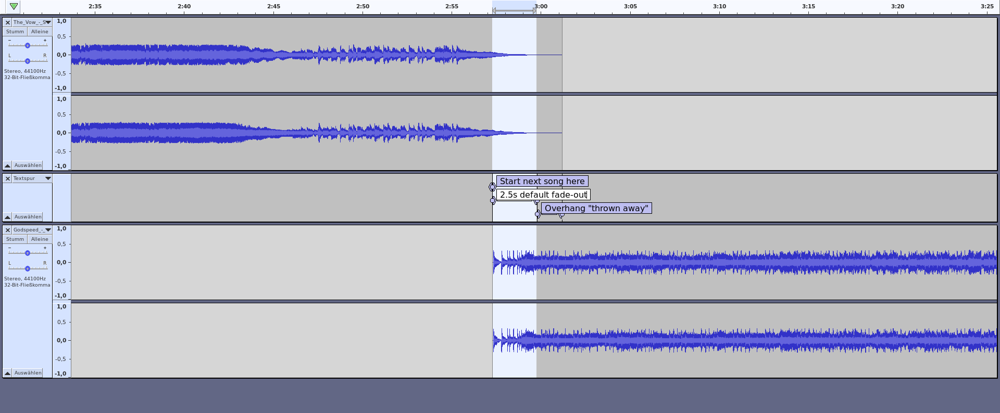

# Navigation

- <kbd>space</kbd> – next slide
- arrow keys <kbd>←→↓↑</kbd> – navigate
- <kbd>Shift</kbd>+<kbd>↑↓</kbd> – jump to top/bottom of a topic
- <kbd>Esc</kbd> – overview
- <kbd>Ctrl</kbd>+<kbd>Mouseclick</kbd> – zoom in/out
- <kbd>Home</kbd>, <kbd>End</kbd> – jump to start/end

# Sneak preview!

Here is a little **sneak preview**,  
dont’t miss [the real event](http://www.liquidsoap.info/liquidshop/4/)!

_The full presentation will be made available here  
after the event._

# Autocue

> On-the-fly JSON song cue-in, cue-out, overlay, replaygain calculation for Liquidsoap, AzuraCast and other AutoDJ software.

Phew! Now what does _that_ mean?

## Better song transitions for Radio Automation ("AutoDJ").

- Remove silence at start & end of tracks.
- Find ideal point for starting the next track.
- Auto loudness correction ("ReplayGain").
- Based on loudness perception of the _human ear_, not simple dB, amplitude or RMS values.
- Can work _on-the-fly_, without pre-processed files.

## And more…

- Keep songs with long endings intact.
- Skip silence within songs ("hidden tracks").
- Clipping prevention.
- Use file _tags_ for less CPU & higher speed.
- Follows EBU (European Broadcasting Union) recommendations.

# ...

# A real example

Let’s visualize what autocue does.

## 1. Find start point for next song

  
Long smooth endings will be kept intact.

## 2. Default fade-out

  
Limits overlay length (too long sounds bad).

## 3. Cut off "overhang"

## The result

  
  
Smooth, continuous playout, radio-style.  
And perfect transitions—everytime.

# ...

# Links

::: {.smaller}
- Liquidsoap: [https://github.com/savonet/liquidsoap](https://github.com/savonet/liquidsoap)
- AzuraCast: [https://github.com/AzuraCast/AzuraCast](https://github.com/AzuraCast/AzuraCast)
- Autocue: [https://github.com/Moonbase59/autocue](https://github.com/Moonbase59/autocue)

<nbsp>

- I’m also on the _Liquidsoap_ and _AzuraCast_ servers on Discord, as "Moonbase59".

<nbsp>

- This presentation will be made available as:
  - recording on YouTube (check the [Liquidshop 4 page](http://www.liquidsoap.info/liquidshop/4/))
  - [web page](https://moonbase59.github.io/autocue/presentation/autocue.html) (reveal.js)
  - downloadable [PDF file](https://moonbase59.github.io/autocue/presentation/autocue.pdf)
:::

# Thanks!

  
Matthias C. Hormann  
(“Moonbase59”)
