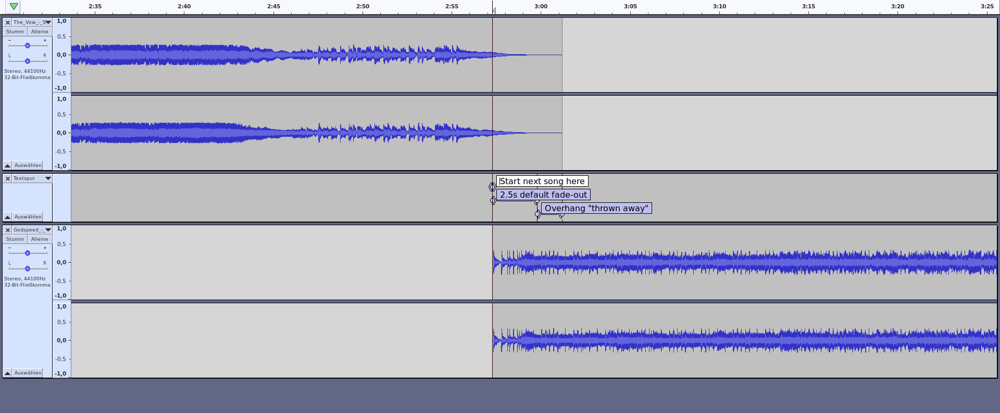
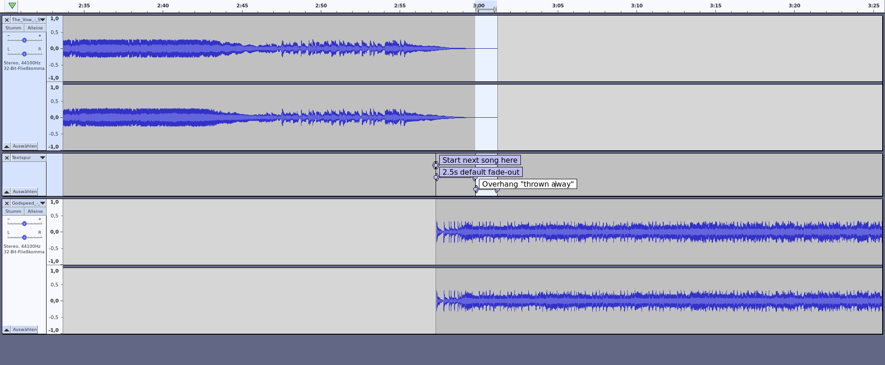
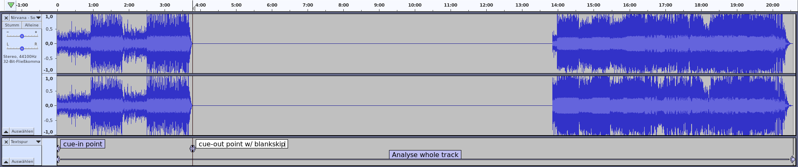
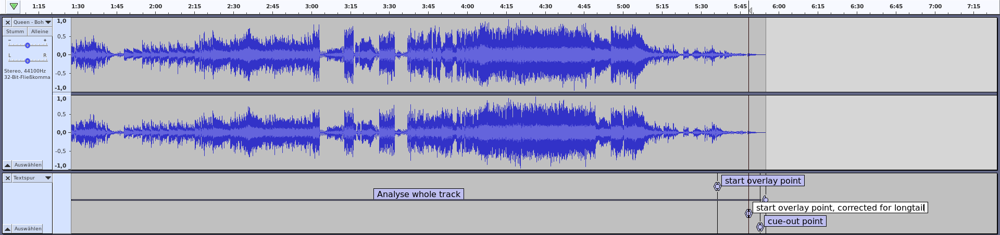
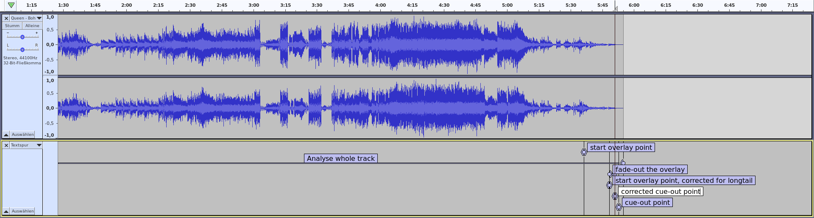
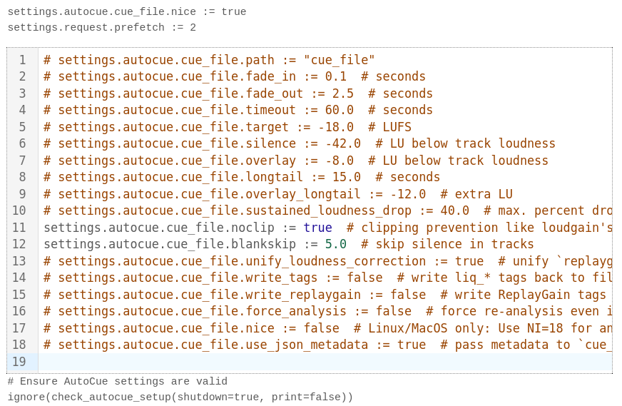

# Navigation

- <kbd>space</kbd> – next slide
- arrow keys <kbd>←→↓↑</kbd> – navigate
- <kbd>Shift</kbd>+<kbd>↑↓</kbd> – jump to top/bottom of a topic
- <kbd>Esc</kbd> – overview
- <kbd>Ctrl</kbd>+<kbd>Mouseclick</kbd> – zoom in/out
- <kbd>Home</kbd>, <kbd>End</kbd> – jump to start/end

# Autocue

> On-the-fly JSON song cue-in, cue-out, overlay, replaygain calculation for Liquidsoap, AzuraCast and other AutoDJ software.

Phew! Now what does _that_ mean?

## Better song transitions for Radio Automation ("AutoDJ").

- Remove silence at start & end of tracks.
- Find ideal point for starting the next track.
- Auto loudness correction ("ReplayGain").
- Based on loudness perception of the _human ear_, not simple dB, amplitude or RMS values.
- Can work _on-the-fly_, without pre-processed files.

## And more…

- Keep songs with long endings intact.
- Skip silence within songs ("hidden tracks").
- Clipping prevention.
- Use file _tags_ for less CPU & higher speed.
- Follows EBU (European Broadcasting Union) recommendations.


# The Story

## User demand

On the AzuraCast GitHub, the "Professional Crossfade" thread is the single most active discussion.

  
There is a huge user demand for radio-like, more professional song transitions!

## Previous work

**John Warburton** ("Warblefly"), an industry professional and Tonmeister, already talked about ["Easing automation and improving your sound with Liquidsoap and FFmpeg"](https://www.youtube.com/watch?v=FPPATbOZKgg) in 2021 (Liquidshop 1).

He also made available his [pre-processing and playlist annotation scripts](https://github.com/Warblefly/TrackBoundaries). Thanks for sharing, John!

## cue_file

Inspired by John’s work, I started writing `cue_file` in early February 2024, as a proof of concept, to see if "on-the-fly" processing could be done.

`cue_file` is a Python3 script, that in turn uses _ffmpeg_ and _ffprobe_ to analyse an audio file for cueing and transition data, based on the loudness perception of the human ear. It uses the EBU R.128 algorithms and returns JSON data.

## Liquidsoap Integration

Many talks and tests with **RM-FM**, **toots** and **Stefan** (gAlleb) brought up two solutions:

- RM-FM and toots worked on an "all-Liquidsoap" approach.
- I favoured and worked on the "external" solution, for more flexibility and pre-processing purposes.
- toots came up with a Liquidsoap integration API for both variants.


# Two Integrations

## autocue.internal

- No external dependencies (apart from ffmpeg).
- Easy to use.
- Made by **RM-FM** and **toots**.

## autocue.cue_file

- Requires _ffmpeg_, _ffprobe_, _Python3_ and _`cue_file`_.
- `%include` or copy-paste (AzuraCast).
- Relatively easy to use, great defaults.
- Many additional features.
- Perfect for pre-processing.
- Can use file _tags_ for dramatic speed increase.
- Made by **Moonbase59** and **toots**.

## Overview

- Many concepts are similar in both implementations.
- Some differ.
- Both use the same integration API.
- It’s _your_ choice.

In this presentation, we will concentrate on **autocue.cue_file**.


# A real example

Let’s visualize what autocue does.

## 1. Find start point for next song

  
Long smooth endings will be kept intact.

## 2. Default fade-out

  
Limits overlay length (too long sounds bad).

## 3. Cut off "overhang"



## The result

  
  
Smooth, continuous playout, radio-style.  
And perfect transitions—everytime.


# How does it work?

Concepts, units, and inner workings explained.  
With visual examples.

## Volume vs Loudness

- Often misunderstood, and complicated to explain correctly (volume, level, gain, amplitude, dB, SPL, RMS, VU, LUFS, LKFS, …)

Let’s make it easy and just say:

- **Volume** = _quantity_ or _power_ of a sound
- **Loudness** = human _perception_ of sound
- Autocue works **loudness-based** (what you _hear_).

## Units we use

- **Amplitude** (0.0 .. 1.0, silence to loudest, linear)
- **dB** (ratio between measurement and reference)
- **dBFS** (dB relative to full scale)
- **LU** (loudness units; 1 LU ≙ 1 dB)
- **LUFS** (loudness units relative to full scale)
- dBFS/LUFS scale (logarithmic):
  - 0.0 = loudest signal without distortion
  - -96.0 = digital silence for 16-bit audio data

## How much is "twice as loud"?

| | |
|--:|:--|:--|
|+10 dB|2x _perceived_ loudness (psycho-acoustics)|mostly _sensed_|
|+6 dB|2x sound pressure (RMS voltage, amplitude)|mostly _measured_|
|+3 dB|2x intensity (power, energy)|mostly _calculated_|

We have to be _specific_ in acoustics!

## Analysing a track

::: { .smaller }
_Queen: Bohemian Rhapsody_


- Analyse whole track, measuring
  - momentary loudness of a 400 ms sliding window, every 100 ms
  - integrated loudness over total duration, using a noise gate
  - loudness range (dynamic range)
  - true peak, all channels, using oversampling
- Results in `liq_loudness`, `liq_loudness_range`, `liq_true_peak`
:::

## cue-in point

::: { .smaller }


- Silence level: **-42 LU** referencing integrated track loudness.
  For a song with -18 LUFS loudness, the noise floor would thus be at -60 LUFS.
- `settings.autocue.cue_file.silence`
- Look _forward from the start_, find where momentary loudness goes above silence level.
- This is our cue-in point (`liq_cue_in`).
:::

## cue-out point

::: { .smaller }


- Look _backwards from the end_, find where momentary loudness goes above silence level.
- This is our cue-out point (`liq_cue_out`).
:::

## cue-out point w/ blankskip

::: { .smaller }
_Nirvana: Something in the Way / Endless, Nameless_


- Look _forward from cue-in_, find where momentary loudness goes below silence level.
- We’re now cueing out _early_ (at the start of the silent part in the song), avoiding "dead air" for songs with "hidden tracks".
- Results in `liq_cue_out`, `liq_blank_skipped`.
:::

## start overlay point (next song)

::: { .smaller }


- Overlay level: **-8 LU** referencing integrated track loudness.
- `settings.autocue.cue_file.overlay`
- Look _backwards from cue-out_, find where momentary loudness goes above overlay level.
- This would be an ideal point to start the next song,  
  but it _might_ cut short important long song endings (as shown above).
- Result in `liq_cross_start_next`.
:::

## Long tails

::: { .smaller }


- Check if calculated overlay duration > **15 s** (a "long tail").
- `settings.autocue.cue_file.longtail`
- If so, reduce overlay level by an extra **-12 LU** and repeat the calculation.
- `settings.autocue.cue_file.overlay_longtail`
- We now start the next song much later, keeping the song’s "long tail" intact!
- `liq_longtail` shows if a long tail was detected.
:::

## fade-out

::: { .smaller }


- Apply fade-out, so overlay isn’t too long.
- `settings.autocue.cue_file.fade_out`
- Too long overlays sound bad, especially when a jingle follows.
- `liq_fade_out`
:::

## correct cue-out

::: { .smaller }


- Correct cue-out (overhang "thrown away")
:::


## amplify & ReplayGain

::: { .smaller }


- From the integrated loudness of the track, and the desired loudness target, we can now calculate the _amplification_ and _ReplayGain_ values.
- `settings.autocue.cue_file.target`
- `settings.autocue.cue_file.unify_loudness_correction`
- Recommended loudness targets:
  - Europe: **-23 LUFS** (EBU) or **-18 LUFS** (EBU, "temporarily allowed")
  - U.S.: **-24 LUFS** (ATSC), not (yet?) supported in _ffmpeg_
- Results in `liq_amplify`, `liq_reference_loudness`, `replaygain_track_gain`, `replaygain_reference_loudness`.
:::

## Clipping prevention

::: { .smaller }


- Modern highly-compressed ("loudness war") music and file formats using lossy compression can easily _clip_ (distort).
- To prevent this, both _loudgain_ and *cue_file* can reduce the amplification/ReplayGain values, using the measured true peak values, so that the EBU-recommended -1 dBFS is not exceeded.
- `settings.autocue.cue_file.noclip`
- **Note:** This is just a loudness reduction, not a brickwall limiter or the like!
- Applied correction amount shown in `liq_amplify_adjustment`.
:::

## Let’s now move to real-life usage

That’s much easier. Promised.

Because autocue does all the work for you.


# A minimal example

Using standalone Liquidsoap

## Preparation

- Copy `cue_file` to appropriate location in the path. On Linux, this is usually one of these:

  - `~/bin`
  - `~/.local/bin`
  - `/usr/local/bin` (needs `sudo`)

- Ensure you have _Python3_, _ffmpeg_ and _ffprobe_ available. On almost all distros, these are pre-installed.

## Liquidsoap code

```liquidsoap
# Minimal example for the `autocue.cue_file` protocol.
# Uses one playlist and outputs to sound card.

%include "autocue.cue_file.liq"
# Ensure AutoCue settings are valid
ignore(check_autocue_setup(shutdown=true, print=true))
enable_autocue_metadata()

radio = playlist("Classic Rock.m3u")

radio = amplify(1., override="liq_amplify", radio)
radio = crossfade(radio)

radio = mksafe(radio)
output(radio)
```
## Now that _was _ easy, right?


# Usage with AzuraCast

## It’s included!

Since 2024-05-21, AzuraCast Rolling Releases have *autocue.cue_file* included, ready to use!

Switch it on in _Edit Station Profile → AutoDJ_:


## Notes

- No complicated copy-pasting and setup anymore.
- Replaces crossfading code for optimum result.
- Fine-tune your personal settings in _Broadcasting → Edit Liquidsoap Configuration_, second input box.
- If you used the manual integration before, you must remove all its traces (copy-pasted code, cue_file) before using this.
- Save changes and _Restart Broadcasting_.

## Settings example

{ height=400 }  
I put _all_ settings in, so I don’t have to look them up.

## Initial startup

- Initial startup takes a moment longer.
- Initial startup will use more CPU.
- Liquidsoap has to reach out and prepare (i.e., autocue) the next tracks for all your playlists, to be ready for immediate playout in case of fallbacks.
- **Don’t be alarmed!** CPU load will decrease to normal levels after a few minutes.

## Enjoy!


# — Break —

Thanks for following so far!

More Tech and a Question & Answer section follow in

**Part II**


# Here be dragons

It’s now time for the **technical stuff!**

So breathe deeply and get a beverage of your choice.

;-)


# Settings

::: {.smaller}
Here's a list of all possible settings with their defaults.  
You _can_ fine-tune everything, but the defaults are great for nearly all use cases!
```
# settings.autocue.cue_file.path := "cue_file"
# settings.autocue.cue_file.fade_in := 0.1  # seconds
# settings.autocue.cue_file.fade_out := 2.5  # seconds
# settings.autocue.cue_file.timeout := 60.0  # seconds
# settings.autocue.cue_file.target := -18.0  # LUFS
# settings.autocue.cue_file.silence := -42.0  # LU below track loudness
# settings.autocue.cue_file.overlay := -8.0  # LU below track loudness
# settings.autocue.cue_file.longtail := 15.0  # seconds
# settings.autocue.cue_file.overlay_longtail := -12.0  # extra LU
# settings.autocue.cue_file.sustained_loudness_drop := 40.0  # max. percent drop to be considered sustained
# settings.autocue.cue_file.noclip := false  # clipping prevention like loudgain's `-k`
# settings.autocue.cue_file.blankskip := 0.0  # skip silence in tracks
# settings.autocue.cue_file.unify_loudness_correction := true  # unify `replaygain_track_gain` & `liq_amplify`
# settings.autocue.cue_file.write_tags := false  # write liq_* tags back to file
# settings.autocue.cue_file.write_replaygain := false  # write ReplayGain tags back to file
# settings.autocue.cue_file.force_analysis := false  # force re-analysis even if tags found
# settings.autocue.cue_file.nice := false  # Linux/MacOS only: Use NI=18 for analysis
# settings.autocue.cue_file.use_json_metadata := true  # pass metadata to `cue_file` as JSON
```
:::

## The Request Queue

- Autocue, if using `enable_autocue_metadata()`, automatically sets
```
settings.request.prefetch := 2
```

- This means we will at all times have _the next two requests_ available for immediate playout. It also gives autocue enough time to process requests in advance.

- In AzuraCast, this blocks the first two entries in the "up next" queue from being deleteable.

# Commandline usage

You can use `cue_file` on the commandline.  
It returns standard JSON data:

::: {.smaller}
```
$ cue_file "The_Vow_-_Spread_Some_Love.mp3"
Overlay: -14.72 LUFS, Longtail: -29.73 LUFS, Measured end avg: -30.91 LUFS, Drop: 38.45%
Overlay times: 177.30/180.10/0.00 s (normal/sustained/longtail), using: 180.10 s.
Cue out time: 181.10 s
{"duration": 181.2, "liq_cue_duration": 181.1, "liq_cue_in": 0.0, "liq_cue_out": 181.1, "liq_cross_start_next": 180.1, "liq_longtail": false, "liq_sustained_ending": true, "liq_loudness": "-6.72 LUFS", "liq_loudness_range": "5.86 LU", "liq_amplify": "-11.28 dB", "liq_amplify_adjustment": "0.00 dB", "liq_reference_loudness": "-18.00 LUFS", "liq_blankskip": 0.0, "liq_blank_skipped": false, "liq_true_peak": 1.177, "liq_true_peak_db": "1.42 dBFS"}
```
:::

This is ideal for debugging or pre-processing scripts.

---

For sorted, more human-readable output, use `jq -S`:

::: {.smaller}
```
$ cue_file "The_Vow_-_Spread_Some_Love.mp3" | jq -S
Overlay: -14.72 LUFS, Longtail: -29.73 LUFS, Measured end avg: -30.91 LUFS, Drop: 38.45%
Overlay times: 177.30/180.10/0.00 s (normal/sustained/longtail), using: 180.10 s.
Cue out time: 181.10 s
{
  "duration": 181.2,
  "liq_amplify": "-11.28 dB",
  "liq_amplify_adjustment": "0.00 dB",
  "liq_blank_skipped": false,
  "liq_blankskip": 0,
  "liq_cross_start_next": 180.1,
  "liq_cue_duration": 181.1,
  "liq_cue_in": 0,
  "liq_cue_out": 181.1,
  "liq_longtail": false,
  "liq_loudness": "-6.72 LUFS",
  "liq_loudness_range": "5.86 LU",
  "liq_reference_loudness": "-18.00 LUFS",
  "liq_sustained_ending": true,
  "liq_true_peak": 1.177,
  "liq_true_peak_db": "1.42 dBFS"
}
```
:::

---

Use `cue_file --help` for more information.

::: {.smaller}
```
$ cue_file --help
usage: cue_file [-h] [-V] [-t TARGET] [-s SILENCE] [-o OVERLAY] [-l LONGTAIL]
                [-x EXTRA] [-d DROP] [-k] [-b [BLANKSKIP]] [-w] [-r] [-f] [-n]
                [-j JSON]
                file

Analyse audio file for cue-in, cue-out, overlay and EBU R128 loudness data,
results as JSON. Optionally writes tags to original audio file, avoiding
unnecessary re-analysis and getting results MUCH faster. This software is
mainly intended for use with my Liquidsoap "autocue:" protocol.

cue_file 4.0.2 supports writing tags to these file types:
.aac, .aif, .aifc, .aiff, .alac, .ape, .asf, .flac, .m2a, .m4a, .m4b, .m4p,
.m4r, .m4v, .mp+, .mp2, .mp3, .mp4, .mpc, .ofr, .ofs, .oga, .ogg, .ogv, .opus,
.spx, .wav, .wma, .wmv, .wv.
More file types are available when Mutagen is installed (True).

positional arguments:
  file                  File to be processed

options:
  -h, --help            show this help message and exit
  -V, --version         show program's version number and exit
  -t TARGET, --target TARGET
                        LUFS reference target; -23.0 to 0.0 (default: -18.0)
  -s SILENCE, --silence SILENCE
                        LU below integrated track loudness for cue-in & cue-
                        out points (silence removal at beginning & end of a
                        track) (default: -42.0)
  -o OVERLAY, --overlay OVERLAY
                        LU below integrated track loudness to trigger next
                        track (default: -8.0)
  -l LONGTAIL, --longtail LONGTAIL
                        More than so many seconds of calculated overlay
                        duration are considered a long tail, and will force a
                        recalculation using --extra, thus keeping long song
                        endings intact (default: 15.0)
  -x EXTRA, --extra EXTRA
                        Extra LU below overlay loudness to trigger next track
                        for songs with long tail (default: -15.0)
  -d DROP, --drop DROP  Max. percent loudness drop at the end to be still
                        considered having a sustained ending. Such tracks will
                        be recalculated using --extra, keeping the song ending
                        intact. Zero (0.0) to switch off. (default: 40.0)
  -k, --noclip          Clipping prevention: Lowers track gain if needed, to
                        avoid peaks going above -1 dBFS. Uses true peak values
                        of all audio channels. (default: False)
  -b [BLANKSKIP], --blankskip [BLANKSKIP]
                        Skip blank (silence) within track if longer than
                        [BLANKSKIP] seconds (get rid of "hidden tracks"). Sets
                        the cue-out point to where the silence begins. Don't
                        use this with spoken or TTS-generated text, as it will
                        often cut the message short. Zero (0.0) to switch off.
                        Omitting [BLANKSKIP] defaults to 5.0 s. (default: 0.0)
  -w, --write           Write Liquidsoap liq_* tags to file. Ensure you have
                        enough free space to hold a copy of the original file.
                        (default: False)
  -r, --replaygain      Write ReplayGain tags to file (track only, no album).
                        Useful if your files have no previous RG tags. Only
                        valid if -w/--write is also specified. (default:
                        False)
  -f, --force           Force re-analysis, even if tags exist (default: False)
  -n, --nice            Linux/MacOS only: Use nice? Will run analysis at nice
                        level 18. (default: False)
  -j JSON, --json JSON  Read/override tags from a JSON file. Use - to read
                        from stdin. Intended for pre-processing software which
                        can, for instance, fill in values from their database
                        here. (default: None)

Note cue_file will use the LARGER value from the sustained ending and longtail
calculations to set the next track overlay point. This ensures special song
endings are always kept intact in transitions.

cue_file 4.0.2 knows about these tags:
duration, liq_amplify, liq_amplify_adjustment, liq_blank_skipped,
liq_blankskip, liq_cross_duration, liq_cross_start_next, liq_cue_duration,
liq_cue_in, liq_cue_out, liq_fade_in, liq_fade_out, liq_hook1_in,
liq_hook1_out, liq_hook2_in, liq_hook2_out, liq_hook3_in, liq_hook3_out,
liq_longtail, liq_loudness, liq_loudness_range, liq_ramp1, liq_ramp2,
liq_ramp3, liq_reference_loudness, liq_sustained_ending, liq_true_peak,
liq_true_peak_db, r128_track_gain, replaygain_reference_loudness,
replaygain_track_gain, replaygain_track_peak, replaygain_track_range.

The absolute minimum set to (possibly) avoid a re-analysis is:
duration, liq_cross_start_next, liq_cue_in, liq_cue_out,
replaygain_track_gain.

A full audio file analysis can take some time. cue_file tries to avoid a
(re-)analysis if all required data can be read from existing tags in the file.

Please report any issues to https://github.com/Moonbase59/autocue/issues
```
:::


# Metadata

Metadata is used in a _prioritized_ manner,  
so parameters can easily be _stored_  
and _overridden_ if needed.

The priorities are, from low to high:

- Metadata calculated by `cue_file`
- Metadata stored in file _tags_
- Metadata given in _annotations_

## This means:

- **Tags** in files can override `cue_file` behaviour, and allow it to just _use_ these values instead of doing a costly re-analysis.
- The user can still override these by using **annotations**. This mechanism is also used by AzuraCast’s _Visual Cue Editor_, so the user settings always "win" over defaults or stored tags.

## Using pre-tagged files is _fast!_

{ height=400 }  
Nirvana song: 222 times faster!

## cue_file is "intelligent"

- Depending on requested parameters and stored file tags, it tries to avoid a costly re-analysis.

Examples:

- Needed file tags missing → new analysis (slow)
- Tags fit request → use tags, no new analysis (fast)
- Playout at -14 LUFS requested, tags are -18 LUFS → can recalculate, no new analysis (fast)
- blankskip disabled, tags include blankskip (and vice versa) → re-analysis forced (slow)

## Tag example

  
Tags written by `cue_file -w`.

## ReplayGain Tags

  
ReplayGain tags are _used_ by `cue_file`  
but _only written back to audio files on request_.  
This preserves your data from unintended changes.

## Annotation example

```liquidsoap
uri = "/home/matthias/Musik/Other/Jingles/Short"
jingles = playlist(prefix='annotate:liq_blankskip=0.0,'
  ^ 'liq_fade_in=0.10,liq_fade_out=0.10'
  ^ ':', uri)
```

A jingles playlist: We want to disable blank skipping and set fade-in and fade-out times to 0.1 s, respectively.

## AzuraCast Visual Cue Editor

{ height=400 }  
Values set here are used as _annotations_, which have the highest priority. Just what we want.


# Metadata categories

Basically, we use three _types_ of metadata:

- _"Switches"_ that control autocue functionality, on a _per-file_ or _per-playlist_ basis.
- _Results_ that are used in further playout processing.
- _Informational_ metadata that might come in handy.

## "Switches"

- `liq_blankskip` (float)  
  <small>Sets blank skipping min. duration (0.0=disable)</small>
- `liq_cue_file` (bool)  
  <small>Enables/disables autocue (i.e., for large video files)</small>
- AzuraCast `jingle_mode` (bool)  
  <small>Disables blank skipping for AzuraCast "Jingle Mode" playlists</small>
- SAM Broadcaster `songtype` (char)  
  <small>Disables blank skipping for song types other than "S" (Song)</small>

## Results

- `duration` (s)
- `liq_amplify` (dB)
- `liq_amplify_adjustment` (dB)
- `liq_cross_start_next` (s)
- `liq_cue_in` (s)
- `liq_cue_out` (s)
- `liq_reference_loudness` (LUFS)
- `replaygain_track_gain` (dB)
- `replaygain_reference_loudness` (LUFS)

## Informational

- `liq_blank_skipped` (bool)
- `liq_cue_duration` (s)
- `liq_longtail` (bool)
- `liq_sustained_ending` (bool)
- `liq_loudness` (LUFS)
- `liq_loudness_range` (LU)
- `liq_true_peak` (dBFS)

## Others

There _are_ a plethora of other metadata that are either used internally, or reserved for future expansion.

Fading data (duration, type, curve), cross duration, Opus Gain, ramp and hook points belong to this category.


# The logfile

- The Liquidsoap _log file_ clearly shows autocue’s workings.
- It’s an invaluable tool for diagnosing problems.
- Logging Levels:
  - 2: Severe (errors/problems detected)
  - 3: Important (autocue information and results)
  - 4: Info (for debugging, _lots_ of output)

## Log: autocue.cue_file

{ height=400 }  
Shows autocue information and results

## Log: show_meta

{ height=400 }  
Shows final values used in playout  
(`liq_*` & `replaygain` metadata)

# Download, Documentation

GitHub repo:  
[https://github.com/Moonbase59/autocue/](https://github.com/Moonbase59/autocue/)

---

## Docs & Examples on GitHub

{ height=400 }

## Docs & Examples on GitHub

{ height=400 }


# Roadmap

- ~~Scrap `autocue2`. `autocue.cue_file` is the supported integrated solution for LS 2.2.5 & newer.~~
- ~~Update documentation.~~
- ~~Fix "double autocue" issue.~~
- Fix "new fade-in > old fade-out" issue with **toots**.
- Testing with LS 2.3.x.
- ~~AzuraCast integration with **BusterNeece**.~~ (WIP)


# Questions & Answers


# Links

::: {.smaller}
- Liquidsoap: [https://github.com/savonet/liquidsoap](https://github.com/savonet/liquidsoap)
- AzuraCast: [https://github.com/AzuraCast/AzuraCast](https://github.com/AzuraCast/AzuraCast)
- Autocue: [https://github.com/Moonbase59/autocue](https://github.com/Moonbase59/autocue)

<nbsp>

- I’m also on the _Liquidsoap_ and _AzuraCast_ servers on Discord, as "Moonbase59".

<nbsp>

- This presentation is available as:
  - recording on YouTube (check the [Liquidshop 4 page](http://www.liquidsoap.info/liquidshop/4/))
  - [web page](https://moonbase59.github.io/autocue/presentation/autocue.html) (reveal.js)
  - downloadable [PDF file](https://moonbase59.github.io/autocue/presentation/autocue.pdf)
:::

# Thanks!

  
Matthias C. Hormann (“Moonbase59”)

**If you like what you got, please consider to [](https://www.paypal.com/donate/?hosted_button_id=PBPR63362LDEU). Thank you! ❤️**
